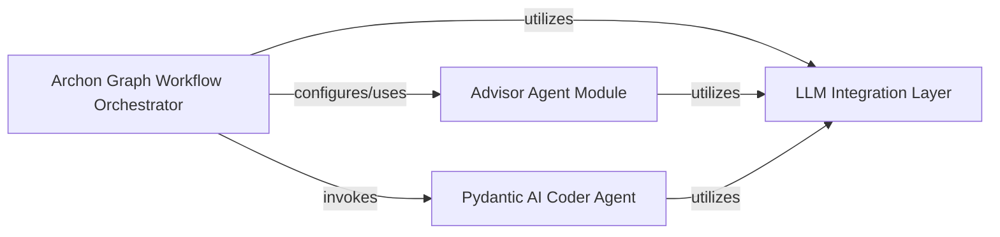

## Component Details

This system orchestrates the AI agent creation process, managing workflow stages from scope definition to code generation and user interaction. It integrates various specialized AI agents, including an advisory agent for initial guidance, a coder agent for code generation, and a centralized LLM integration layer for interacting with different language models.

### Archon Graph Workflow Orchestrator
This component defines and manages the overall flow of the AI agent creation process. It orchestrates different stages, including scope definition, code generation, and user interaction routing, using a LangGraph StateGraph. It also sets up and integrates various specialized agents.

**Related Classes/Methods**:

- <a href="https://github.com/coleam00/Archon/blob/master/iterations/v4-streamlit-ui-overhaul/archon/archon_graph.py#L79-L82" target="_blank" rel="noopener noreferrer">`archon.archon_graph:AgentState` (79:82)</a>
- <a href="https://github.com/coleam00/Archon/blob/master/iterations/v4-streamlit-ui-overhaul/archon/archon_graph.py#L85-L119" target="_blank" rel="noopener noreferrer">`archon.archon_graph:define_scope_with_reasoner` (85:119)</a>
- <a href="https://github.com/coleam00/Archon/blob/master/iterations/v4-streamlit-ui-overhaul/archon/archon_graph.py#L122-L152" target="_blank" rel="noopener noreferrer">`archon.archon_graph:coder_agent` (122:152)</a>
- <a href="https://github.com/coleam00/Archon/blob/master/iterations/v4-streamlit-ui-overhaul/archon/archon_graph.py#L155-L161" target="_blank" rel="noopener noreferrer">`archon.archon_graph:get_next_user_message` (155:161)</a>
- <a href="https://github.com/coleam00/Archon/blob/master/iterations/v4-streamlit-ui-overhaul/archon/archon_graph.py#L164-L180" target="_blank" rel="noopener noreferrer">`archon.archon_graph:route_user_message` (164:180)</a>
- <a href="https://github.com/coleam00/Archon/blob/master/iterations/v4-streamlit-ui-overhaul/archon/archon_graph.py#L183-L203" target="_blank" rel="noopener noreferrer">`archon.archon_graph:finish_conversation` (183:203)</a>
- `archon.archon_graph:builder` (full file reference)
- `archon.archon_graph:agentic_flow` (full file reference)
- `archon.archon_graph:reasoner` (full file reference)
- `archon.archon_graph:router_agent` (full file reference)
- `archon.archon_graph:end_conversation_agent` (full file reference)

### Advisor Agent Module
This module encapsulates the logic for an advisory AI agent. It provides tools and system prompts to assist in gathering relevant information, such as file contents, which can be used by other parts of the Archon system. It uses AdvisorDeps to manage its operational context.

**Related Classes/Methods**:

- <a href="https://github.com/coleam00/Archon/blob/master/iterations/v6-tool-library-integration/archon/advisor_agent.py#L37-L38" target="_blank" rel="noopener noreferrer">`archon.advisor_agent:AdvisorDeps` (37:38)</a>
- <a href="https://github.com/coleam00/Archon/blob/master/iterations/v6-tool-library-integration/archon/advisor_agent.py#L44-L49" target="_blank" rel="noopener noreferrer">`archon.advisor_agent:advisor_agent` (44:49)</a>
- <a href="https://github.com/coleam00/Archon/blob/master/iterations/v6-tool-library-integration/archon/advisor_agent.py#L48-L57" target="_blank" rel="noopener noreferrer">`archon.advisor_agent:add_file_list` (48:57)</a>
- <a href="https://github.com/coleam00/Archon/blob/master/iterations/v6-tool-library-integration/archon/advisor_agent.py#L60-L70" target="_blank" rel="noopener noreferrer">`archon.advisor_agent:get_file_content` (60:70)</a>

### Pydantic AI Coder Agent
This component is a specialized AI agent responsible for generating and modifying Python code based on user requests and defined scope, leveraging the Pydantic AI framework. It interacts with external dependencies like Supabase and OpenAI to perform its coding tasks.

**Related Classes/Methods**:

- `archon.pydantic_ai_coder:pydantic_ai_coder` (full file reference)
- <a href="https://github.com/coleam00/Archon/blob/master/iterations/v4-streamlit-ui-overhaul/archon/pydantic_ai_coder.py#L38-L41" target="_blank" rel="noopener noreferrer">`archon.pydantic_ai_coder:PydanticAIDeps` (38:41)</a>

### LLM Integration Layer
This component handles the integration with various Large Language Models (LLMs) such as OpenAI and Anthropic. It provides a standardized interface for different agents within the Archon system to interact with various LLM providers for their reasoning and generation tasks.

**Related Classes/Methods**:

- `archon.archon_graph:reasoner_llm_model` (full file reference)
- `archon.archon_graph:primary_llm_model` (full file reference)
- <a href="https://github.com/coleam00/Archon/blob/master/iterations/v6-tool-library-integration/archon/advisor_agent.py#L33-L33" target="_blank" rel="noopener noreferrer">`archon.advisor_agent:model` (33:33)</a>
- `pydantic_ai.models.anthropic:AnthropicModel` (full file reference)
- `pydantic_ai.models.openai:OpenAIModel` (full file reference)

### [FAQ](https://github.com/CodeBoarding/GeneratedOnBoardings/tree/main?tab=readme-ov-file#faq)