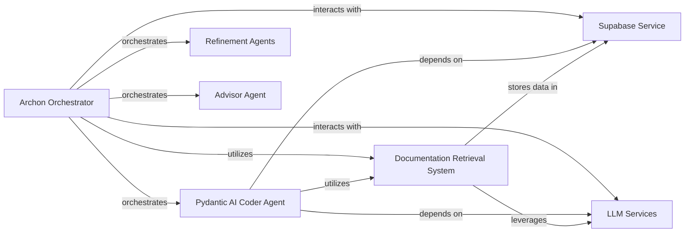

## Component Details

The Agent Orchestration Core is the central control module of the Archon system, responsible for initiating and coordinating various AI agents such as Coder, Advisor, and Refiners. It defines their operational scope, manages the overall workflow of agent creation and refinement, routes user messages, and handles the conclusion of conversations.

### Archon Orchestrator
The central control module responsible for initiating and coordinating various AI agents and defining their operational scope within the Archon system. It manages the overall workflow of agent creation and refinement, routing user messages and finishing conversations.

**Related Classes/Methods**:

- <a href="https://github.com/coleam00/Archon/blob/master/archon/archon_graph.py#L83-L117" target="_blank" rel="noopener noreferrer">`Archon.archon.archon_graph:define_scope_with_reasoner` (83:117)</a>
- <a href="https://github.com/coleam00/Archon/blob/master/archon/archon_graph.py#L120-L143" target="_blank" rel="noopener noreferrer">`Archon.archon.archon_graph:advisor_with_examples` (120:143)</a>
- <a href="https://github.com/coleam00/Archon/blob/master/archon/archon_graph.py#L146-L204" target="_blank" rel="noopener noreferrer">`Archon.archon.archon_graph:coder_agent` (146:204)</a>
- <a href="https://github.com/coleam00/Archon/blob/master/archon/archon_graph.py#L234-L245" target="_blank" rel="noopener noreferrer">`Archon.archon.archon_graph:refine_prompt` (234:245)</a>
- <a href="https://github.com/coleam00/Archon/blob/master/archon/archon_graph.py#L248-L266" target="_blank" rel="noopener noreferrer">`Archon.archon.archon_graph:refine_tools` (248:266)</a>
- <a href="https://github.com/coleam00/Archon/blob/master/archon/archon_graph.py#L269-L286" target="_blank" rel="noopener noreferrer">`Archon.archon.archon_graph:refine_agent` (269:286)</a>
- <a href="https://github.com/coleam00/Archon/blob/master/archon/archon_graph.py#L216-L231" target="_blank" rel="noopener noreferrer">`Archon.archon.archon_graph:route_user_message` (216:231)</a>
- <a href="https://github.com/coleam00/Archon/blob/master/archon/archon_graph.py#L289-L309" target="_blank" rel="noopener noreferrer">`Archon.archon.archon_graph:finish_conversation` (289:309)</a>
- <a href="https://github.com/coleam00/Archon/blob/master/archon/archon_graph.py#L207-L213" target="_blank" rel="noopener noreferrer">`Archon.archon.archon_graph:get_next_user_message` (207:213)</a>
- <a href="https://github.com/coleam00/Archon/blob/master/archon/archon_graph.py#L46-L48" target="_blank" rel="noopener noreferrer">`Archon.archon.archon_graph:reasoner` (46:48)</a>
- <a href="https://github.com/coleam00/Archon/blob/master/archon/archon_graph.py#L54-L56" target="_blank" rel="noopener noreferrer">`Archon.archon.archon_graph:router_agent` (54:56)</a>
- <a href="https://github.com/coleam00/Archon/blob/master/archon/archon_graph.py#L60-L62" target="_blank" rel="noopener noreferrer">`Archon.archon.archon_graph:end_conversation_agent` (60:62)</a>
- <a href="https://github.com/coleam00/Archon/blob/master/archon/archon_graph.py#L70-L80" target="_blank" rel="noopener noreferrer">`Archon.archon.archon_graph:AgentState` (70:80)</a>
- <a href="https://github.com/coleam00/Archon/blob/master/archon/archon_graph.py#L292-L292" target="_blank" rel="noopener noreferrer">`Archon.archon.archon_graph:builder` (292:292)</a>
- <a href="https://github.com/coleam00/Archon/blob/master/archon/archon_graph.py#L310-L310" target="_blank" rel="noopener noreferrer">`Archon.archon.archon_graph:agentic_flow` (310:310)</a>

### Pydantic AI Coder Agent
A specialized AI agent responsible for generating, modifying, and debugging Pydantic AI agent code based on user requirements and refined inputs. It leverages documentation and previous outputs to perform its coding tasks.

**Related Classes/Methods**:

- `archon.pydantic_ai_coder.pydantic_ai_coder` (full file reference)
- <a href="https://github.com/coleam00/Archon/blob/master/iterations/v4-streamlit-ui-overhaul/archon/pydantic_ai_coder.py#L38-L41" target="_blank" rel="noopener noreferrer">`archon.pydantic_ai_coder.PydanticAIDeps` (38:41)</a>
- <a href="https://github.com/coleam00/Archon/blob/master/iterations/v4-streamlit-ui-overhaul/archon/pydantic_ai_coder.py#L333-L358" target="_blank" rel="noopener noreferrer">`archon.pydantic_ai_coder.list_documentation_pages_helper` (333:358)</a>

### Documentation Retrieval System
Provides a set of tools and functions for accessing and retrieving information from a documentation knowledge base, primarily used by AI agents to gather context.

**Related Classes/Methods**:

- <a href="https://github.com/coleam00/Archon/blob/master/iterations/v5-parallel-specialized-agents/archon/agent_tools.py#L59-L84" target="_blank" rel="noopener noreferrer">`archon.agent_tools.list_documentation_pages_tool` (59:84)</a>
- <a href="https://github.com/coleam00/Archon/blob/master/iterations/v5-parallel-specialized-agents/archon/agent_tools.py#L24-L57" target="_blank" rel="noopener noreferrer">`archon.agent_tools.retrieve_relevant_documentation_tool` (24:57)</a>
- <a href="https://github.com/coleam00/Archon/blob/master/iterations/v5-parallel-specialized-agents/archon/agent_tools.py#L86-L123" target="_blank" rel="noopener noreferrer">`archon.agent_tools.get_page_content_tool` (86:123)</a>

### Refinement Agents
A collection of specialized AI agents designed to refine specific aspects of the AI agent being developed, such as prompts, tools, and the overall agent definition.

**Related Classes/Methods**:

- `archon.refiner_agents.tools_refiner_agent.tools_refiner_agent` (full file reference)
- <a href="https://github.com/coleam00/Archon/blob/master/iterations/v5-parallel-specialized-agents/archon/refiner_agents/tools_refiner_agent.py#L42-L44" target="_blank" rel="noopener noreferrer">`archon.refiner_agents.tools_refiner_agent.ToolsRefinerDeps` (42:44)</a>
- `archon.refiner_agents.agent_refiner_agent.agent_refiner_agent` (full file reference)
- <a href="https://github.com/coleam00/Archon/blob/master/iterations/v5-parallel-specialized-agents/archon/refiner_agents/agent_refiner_agent.py#L42-L44" target="_blank" rel="noopener noreferrer">`archon.refiner_agents.agent_refiner_agent.AgentRefinerDeps` (42:44)</a>
- `archon.refiner_agents.prompt_refiner_agent.prompt_refiner_agent` (full file reference)

### Advisor Agent
An AI agent that assists in the initial phase of agent creation by suggesting starting points, examples, or pre-built components from a repository of resources.

**Related Classes/Methods**:

- `archon.advisor_agent.advisor_agent` (full file reference)
- <a href="https://github.com/coleam00/Archon/blob/master/iterations/v6-tool-library-integration/archon/advisor_agent.py#L37-L38" target="_blank" rel="noopener noreferrer">`archon.advisor_agent.AdvisorDeps` (37:38)</a>
- <a href="https://github.com/coleam00/Archon/blob/master/iterations/v6-tool-library-integration/archon/advisor_agent.py#L60-L70" target="_blank" rel="noopener noreferrer">`archon.advisor_agent.get_file_content` (60:70)</a>

### LLM Services
Provides access to various Large Language Models (LLMs) for text generation, reasoning, and other AI tasks.

**Related Classes/Methods**:

- `pydantic_ai.models.anthropic.AnthropicModel` (full file reference)
- `pydantic_ai.models.openai.OpenAIModel` (full file reference)
- `openai.AsyncOpenAI` (full file reference)

### Supabase Service
Provides a database and storage solution, used for documentation retrieval and potentially other data persistence needs.

**Related Classes/Methods**:

- `supabase.Client` (full file reference)

### [FAQ](https://github.com/CodeBoarding/GeneratedOnBoardings/tree/main?tab=readme-ov-file#faq)