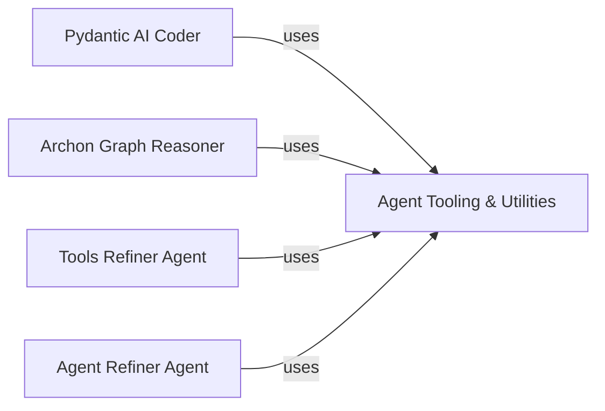

## Component Details

This graph illustrates the core components of the Archon system related to agent tooling and utility functions, and how various agents interact with these tools for tasks such as code generation, reasoning, and agent/tool refinement. The central purpose is to provide a structured overview of how agents leverage shared utility functions for documentation retrieval, content access, and embedding generation.

### Agent Tooling & Utilities
A foundational library providing essential tools and utility functions for various agents, including capabilities for documentation retrieval, page content access, file content access, and text embedding generation. These tools abstract away the complexities of interacting with external services like Supabase and OpenAI.

**Related Classes/Methods**:

- <a href="https://github.com/coleam00/Archon/blob/master/iterations/v5-parallel-specialized-agents/archon/agent_tools.py#L12-L22" target="_blank" rel="noopener noreferrer">`archon.agent_tools:get_embedding` (12:22)</a>
- <a href="https://github.com/coleam00/Archon/blob/master/iterations/v5-parallel-specialized-agents/archon/agent_tools.py#L24-L57" target="_blank" rel="noopener noreferrer">`archon.agent_tools:retrieve_relevant_documentation_tool` (24:57)</a>
- <a href="https://github.com/coleam00/Archon/blob/master/iterations/v5-parallel-specialized-agents/archon/agent_tools.py#L59-L84" target="_blank" rel="noopener noreferrer">`archon.agent_tools:list_documentation_pages_tool` (59:84)</a>
- <a href="https://github.com/coleam00/Archon/blob/master/iterations/v5-parallel-specialized-agents/archon/agent_tools.py#L86-L123" target="_blank" rel="noopener noreferrer">`archon.agent_tools:get_page_content_tool` (86:123)</a>
- `archon.agent_tools:get_file_content_tool` (full file reference)

### Pydantic AI Coder
An AI agent focused on code generation or understanding, which leverages documentation to perform its tasks. It initiates requests to retrieve relevant documentation, list pages, or get specific page content to inform its coding decisions.

**Related Classes/Methods**:

- <a href="https://github.com/coleam00/Archon/blob/master/archon/pydantic_ai_coder.py#L67-L78" target="_blank" rel="noopener noreferrer">`Archon.archon.pydantic_ai_coder:retrieve_relevant_documentation` (67:78)</a>
- <a href="https://github.com/coleam00/Archon/blob/master/archon/pydantic_ai_coder.py#L81-L88" target="_blank" rel="noopener noreferrer">`Archon.archon.pydantic_ai_coder:list_documentation_pages` (81:88)</a>
- <a href="https://github.com/coleam00/Archon/blob/master/archon/pydantic_ai_coder.py#L91-L102" target="_blank" rel="noopener noreferrer">`Archon.archon.pydantic_ai_coder:get_page_content` (91:102)</a>

### Archon Graph Reasoner
Part of the Archon system's core graph or reasoning engine. It defines the scope of operations and interacts with documentation tools, primarily to list available documentation pages, likely for contextual understanding or planning.

**Related Classes/Methods**:

- <a href="https://github.com/coleam00/Archon/blob/master/archon/archon_graph.py#L83-L117" target="_blank" rel="noopener noreferrer">`Archon.archon.archon_graph:define_scope_with_reasoner` (83:117)</a>

### Tools Refiner Agent
A specialized agent designed to refine or improve tools within the Archon system. It queries the documentation for relevant information, lists available pages, and retrieves page content to aid in its refinement process.

**Related Classes/Methods**:

- <a href="https://github.com/coleam00/Archon/blob/master/iterations/v5-parallel-specialized-agents/archon/refiner_agents/tools_refiner_agent.py#L54-L66" target="_blank" rel="noopener noreferrer">`archon.refiner_agents.tools_refiner_agent:retrieve_relevant_documentation` (54:66)</a>
- <a href="https://github.com/coleam00/Archon/blob/master/iterations/v5-parallel-specialized-agents/archon/refiner_agents/tools_refiner_agent.py#L69-L77" target="_blank" rel="noopener noreferrer">`archon.refiner_agents.tools_refiner_agent:list_documentation_pages` (69:77)</a>
- <a href="https://github.com/coleam00/Archon/blob/master/iterations/v5-parallel-specialized-agents/archon/refiner_agents/tools_refiner_agent.py#L80-L92" target="_blank" rel="noopener noreferrer">`archon.refiner_agents.tools_refiner_agent:get_page_content` (80:92)</a>

### Agent Refiner Agent
A specialized agent focuses on refining or improving other agents within the Archon system. Similar to the Tools Refiner, it interacts with the documentation knowledge base to gather necessary information for its refinement tasks.

**Related Classes/Methods**:

- <a href="https://github.com/coleam00/Archon/blob/master/iterations/v5-parallel-specialized-agents/archon/refiner_agents/agent_refiner_agent.py#L54-L66" target="_blank" rel="noopener noreferrer">`archon.refiner_agents.agent_refiner_agent:retrieve_relevant_documentation` (54:66)</a>
- <a href="https://github.com/coleam00/Archon/blob/master/iterations/v5-parallel-specialized-agents/archon/refiner_agents/agent_refiner_agent.py#L69-L77" target="_blank" rel="noopener noreferrer">`archon.refiner_agents.agent_refiner_agent:list_documentation_pages` (69:77)</a>
- <a href="https://github.com/coleam00/Archon/blob/master/iterations/v5-parallel-specialized-agents/archon/refiner_agents/agent_refiner_agent.py#L80-L92" target="_blank" rel="noopener noreferrer">`archon.refiner_agents.agent_refiner_agent:get_page_content` (80:92)</a>

### [FAQ](https://github.com/CodeBoarding/GeneratedOnBoardings/tree/main?tab=readme-ov-file#faq)