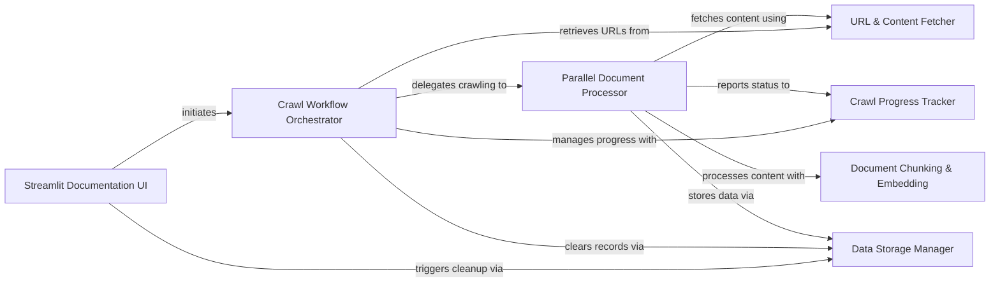

## Component Details

The Documentation Ingestion System manages the complete lifecycle of documentation, from initial crawling and content extraction to chunking, embedding, and storage in a Supabase database for efficient retrieval by AI agents. It orchestrates interactions with external documentation sources and the database, providing a Streamlit UI for user interaction and progress monitoring.

### Crawl Progress Tracker
Tracks and reports the real-time status and logs of the documentation crawling process, providing updates on URLs found, processed, succeeded, failed, and chunks stored.

**Related Classes/Methods**:

- <a href="https://github.com/coleam00/Archon/blob/master/iterations/v4-streamlit-ui-overhaul/archon/crawl_pydantic_ai_docs.py#L64-L141" target="_blank" rel="noopener noreferrer">`archon.crawl_pydantic_ai_docs.CrawlProgressTracker` (64:141)</a>
- <a href="https://github.com/coleam00/Archon/blob/master/iterations/v4-streamlit-ui-overhaul/archon/crawl_pydantic_ai_docs.py#L85-L94" target="_blank" rel="noopener noreferrer">`archon.crawl_pydantic_ai_docs.CrawlProgressTracker:log` (85:94)</a>
- <a href="https://github.com/coleam00/Archon/blob/master/iterations/v4-streamlit-ui-overhaul/archon/crawl_pydantic_ai_docs.py#L96-L104" target="_blank" rel="noopener noreferrer">`archon.crawl_pydantic_ai_docs.CrawlProgressTracker:start` (96:104)</a>
- <a href="https://github.com/coleam00/Archon/blob/master/iterations/v4-streamlit-ui-overhaul/archon/crawl_pydantic_ai_docs.py#L106-L116" target="_blank" rel="noopener noreferrer">`archon.crawl_pydantic_ai_docs.CrawlProgressTracker:complete` (106:116)</a>
- <a href="https://github.com/coleam00/Archon/blob/master/iterations/v4-streamlit-ui-overhaul/archon/crawl_pydantic_ai_docs.py#L118-L131" target="_blank" rel="noopener noreferrer">`archon.crawl_pydantic_ai_docs.CrawlProgressTracker:get_status` (118:131)</a>

### Document Chunking & Embedding
Responsible for breaking down raw document text into smaller, manageable chunks, and generating embeddings, titles, and summaries for each chunk using AI models.

**Related Classes/Methods**:

- <a href="https://github.com/coleam00/Archon/blob/master/iterations/v4-streamlit-ui-overhaul/archon/crawl_pydantic_ai_docs.py#L143-L186" target="_blank" rel="noopener noreferrer">`archon.crawl_pydantic_ai_docs:chunk_text` (143:186)</a>
- <a href="https://github.com/coleam00/Archon/blob/master/iterations/v4-streamlit-ui-overhaul/archon/crawl_pydantic_ai_docs.py#L188-L208" target="_blank" rel="noopener noreferrer">`archon.crawl_pydantic_ai_docs:get_title_and_summary` (188:208)</a>
- <a href="https://github.com/coleam00/Archon/blob/master/iterations/v4-streamlit-ui-overhaul/archon/crawl_pydantic_ai_docs.py#L210-L220" target="_blank" rel="noopener noreferrer">`archon.crawl_pydantic_ai_docs:get_embedding` (210:220)</a>
- <a href="https://github.com/coleam00/Archon/blob/master/iterations/v4-streamlit-ui-overhaul/archon/crawl_pydantic_ai_docs.py#L222-L246" target="_blank" rel="noopener noreferrer">`archon.crawl_pydantic_ai_docs:process_chunk` (222:246)</a>
- <a href="https://github.com/coleam00/Archon/blob/master/iterations/v4-streamlit-ui-overhaul/archon/crawl_pydantic_ai_docs.py#L55-L62" target="_blank" rel="noopener noreferrer">`archon.crawl_pydantic_ai_docs.ProcessedChunk` (55:62)</a>

### Data Storage Manager
Handles the interaction with the Supabase database for inserting new processed document chunks and clearing existing records based on the source.

**Related Classes/Methods**:

- <a href="https://github.com/coleam00/Archon/blob/master/iterations/v4-streamlit-ui-overhaul/archon/crawl_pydantic_ai_docs.py#L248-L266" target="_blank" rel="noopener noreferrer">`archon.crawl_pydantic_ai_docs:insert_chunk` (248:266)</a>
- <a href="https://github.com/coleam00/Archon/blob/master/iterations/v4-streamlit-ui-overhaul/archon/crawl_pydantic_ai_docs.py#L421-L429" target="_blank" rel="noopener noreferrer">`archon.crawl_pydantic_ai_docs:clear_existing_records` (421:429)</a>

### URL & Content Fetcher
Manages the retrieval of sitemap URLs to identify documents to crawl and fetches the actual content from web pages using HTTP requests, converting HTML to Markdown.

**Related Classes/Methods**:

- <a href="https://github.com/coleam00/Archon/blob/master/iterations/v4-streamlit-ui-overhaul/archon/crawl_pydantic_ai_docs.py#L312-L330" target="_blank" rel="noopener noreferrer">`archon.crawl_pydantic_ai_docs:fetch_url_content` (312:330)</a>
- <a href="https://github.com/coleam00/Archon/blob/master/iterations/v4-streamlit-ui-overhaul/archon/crawl_pydantic_ai_docs.py#L402-L419" target="_blank" rel="noopener noreferrer">`archon.crawl_pydantic_ai_docs:get_pydantic_ai_docs_urls` (402:419)</a>

### Parallel Document Processor
Orchestrates the concurrent fetching, processing, and storing of multiple documents, managing the flow from raw URL to stored, embedded chunks.

**Related Classes/Methods**:

- <a href="https://github.com/coleam00/Archon/blob/master/iterations/v4-streamlit-ui-overhaul/archon/crawl_pydantic_ai_docs.py#L332-L400" target="_blank" rel="noopener noreferrer">`archon.crawl_pydantic_ai_docs:crawl_parallel_with_requests` (332:400)</a>
- <a href="https://github.com/coleam00/Archon/blob/master/iterations/v4-streamlit-ui-overhaul/archon/crawl_pydantic_ai_docs.py#L268-L310" target="_blank" rel="noopener noreferrer">`archon.crawl_pydantic_ai_docs:process_and_store_document` (268:310)</a>
- <a href="https://github.com/coleam00/Archon/blob/master/iterations/v4-streamlit-ui-overhaul/archon/crawl_pydantic_ai_docs.py#L337-L390" target="_blank" rel="noopener noreferrer">`archon.crawl_pydantic_ai_docs.crawl_parallel_with_requests.process_url` (337:390)</a>

### Crawl Workflow Orchestrator
The central control unit that initiates the entire documentation crawling process, manages the overall workflow, and integrates various sub-components from URL discovery to final storage.

**Related Classes/Methods**:

- <a href="https://github.com/coleam00/Archon/blob/master/iterations/v4-streamlit-ui-overhaul/archon/crawl_pydantic_ai_docs.py#L431-L486" target="_blank" rel="noopener noreferrer">`archon.crawl_pydantic_ai_docs:main_with_requests` (431:486)</a>
- <a href="https://github.com/coleam00/Archon/blob/master/iterations/v4-streamlit-ui-overhaul/archon/crawl_pydantic_ai_docs.py#L488-L505" target="_blank" rel="noopener noreferrer">`archon.crawl_pydantic_ai_docs:start_crawl_with_requests` (488:505)</a>

### Streamlit Documentation UI
Provides the graphical user interface within the Streamlit application, allowing users to trigger the documentation crawling process and monitor its progress.

**Related Classes/Methods**:

- <a href="https://github.com/coleam00/Archon/blob/master/iterations/v5-parallel-specialized-agents/streamlit_pages/documentation.py#L10-L158" target="_blank" rel="noopener noreferrer">`streamlit_pages.documentation:documentation_tab` (10:158)</a>

### [FAQ](https://github.com/CodeBoarding/GeneratedOnBoardings/tree/main?tab=readme-ov-file#faq)