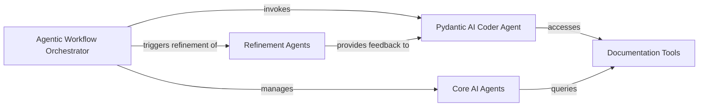

## Component Details

This graph represents the core workflow for creating AI agents. It orchestrates various specialized agents, including a Pydantic AI Coder Agent for code generation, Refinement Agents for iterative improvements, and Core AI Agents for foundational tasks like scope definition and message routing. The workflow manages state transitions, integrates user feedback, and leverages documentation tools to facilitate the agent development process.

### Agentic Workflow Orchestrator
This component orchestrates the entire AI agent creation process, managing state transitions and routing user messages. It integrates various specialized agents, including the advisor, coder, and refiner agents, and utilizes documentation tools.

**Related Classes/Methods**:

- <a href="https://github.com/coleam00/Archon/blob/master/archon/archon_graph.py#L70-L80" target="_blank" rel="noopener noreferrer">`Archon.archon.archon_graph:AgentState` (70:80)</a>
- <a href="https://github.com/coleam00/Archon/blob/master/archon/archon_graph.py#L83-L117" target="_blank" rel="noopener noreferrer">`Archon.archon.archon_graph:define_scope_with_reasoner` (83:117)</a>
- <a href="https://github.com/coleam00/Archon/blob/master/archon/archon_graph.py#L120-L143" target="_blank" rel="noopener noreferrer">`Archon.archon.archon_graph:advisor_with_examples` (120:143)</a>
- <a href="https://github.com/coleam00/Archon/blob/master/archon/archon_graph.py#L146-L204" target="_blank" rel="noopener noreferrer">`Archon.archon.archon_graph:coder_agent` (146:204)</a>
- <a href="https://github.com/coleam00/Archon/blob/master/archon/archon_graph.py#L207-L213" target="_blank" rel="noopener noreferrer">`Archon.archon.archon_graph:get_next_user_message` (207:213)</a>
- <a href="https://github.com/coleam00/Archon/blob/master/archon/archon_graph.py#L216-L231" target="_blank" rel="noopener noreferrer">`Archon.archon.archon_graph:route_user_message` (216:231)</a>
- <a href="https://github.com/coleam00/Archon/blob/master/archon/archon_graph.py#L234-L245" target="_blank" rel="noopener noreferrer">`Archon.archon.archon_graph:refine_prompt` (234:245)</a>
- <a href="https://github.com/coleam00/Archon/blob/master/archon/archon_graph.py#L248-L266" target="_blank" rel="noopener noreferrer">`Archon.archon.archon_graph:refine_tools` (248:266)</a>
- <a href="https://github.com/coleam00/Archon/blob/master/archon/archon_graph.py#L269-L286" target="_blank" rel="noopener noreferrer">`Archon.archon.archon_graph:refine_agent` (269:286)</a>
- <a href="https://github.com/coleam00/Archon/blob/master/archon/archon_graph.py#L289-L309" target="_blank" rel="noopener noreferrer">`Archon.archon.archon_graph:finish_conversation` (289:309)</a>

### Pydantic AI Coder Agent
This intelligent agent is specialized in generating and refining AI agent code, producing structured outputs using Pydantic models. It interacts with documentation retrieval tools and incorporates feedback from refinement agents.

**Related Classes/Methods**:

- <a href="https://github.com/coleam00/Archon/blob/master/archon/pydantic_ai_coder.py#L41-L45" target="_blank" rel="noopener noreferrer">`Archon.archon.pydantic_ai_coder:PydanticAIDeps` (41:45)</a>
- <a href="https://github.com/coleam00/Archon/blob/master/archon/pydantic_ai_coder.py#L44-L49" target="_blank" rel="noopener noreferrer">`Archon.archon.pydantic_ai_coder:pydantic_ai_coder` (44:49)</a>
- <a href="https://github.com/coleam00/Archon/blob/master/archon/pydantic_ai_coder.py#L55-L64" target="_blank" rel="noopener noreferrer">`Archon.archon.pydantic_ai_coder:add_reasoner_output` (55:64)</a>
- <a href="https://github.com/coleam00/Archon/blob/master/archon/pydantic_ai_coder.py#L67-L78" target="_blank" rel="noopener noreferrer">`Archon.archon.pydantic_ai_coder:retrieve_relevant_documentation` (67:78)</a>
- <a href="https://github.com/coleam00/Archon/blob/master/archon/pydantic_ai_coder.py#L81-L88" target="_blank" rel="noopener noreferrer">`Archon.archon.pydantic_ai_coder:list_documentation_pages` (81:88)</a>
- <a href="https://github.com/coleam00/Archon/blob/master/archon/pydantic_ai_coder.py#L91-L102" target="_blank" rel="noopener noreferrer">`Archon.archon.pydantic_ai_coder:get_page_content` (91:102)</a>

### Documentation Tools
This component provides a set of utilities for interacting with documentation, including retrieving relevant content, listing available pages, and fetching specific page content. These tools are utilized by various agents for information retrieval.

**Related Classes/Methods**:

- <a href="https://github.com/coleam00/Archon/blob/master/archon/agent_tools.py#L24-L57" target="_blank" rel="noopener noreferrer">`Archon.archon.agent_tools:retrieve_relevant_documentation_tool` (24:57)</a>
- <a href="https://github.com/coleam00/Archon/blob/master/archon/agent_tools.py#L59-L84" target="_blank" rel="noopener noreferrer">`Archon.archon.agent_tools:list_documentation_pages_tool` (59:84)</a>
- <a href="https://github.com/coleam00/Archon/blob/master/archon/agent_tools.py#L86-L123" target="_blank" rel="noopener noreferrer">`Archon.archon.agent_tools:get_page_content_tool` (86:123)</a>
- <a href="https://github.com/coleam00/Archon/blob/master/archon/agent_tools.py#L12-L22" target="_blank" rel="noopener noreferrer">`Archon.archon.agent_tools:get_embedding` (12:22)</a>

### Refinement Agents
This component comprises specialized agents focused on iteratively improving different aspects of the AI agent under development, such as refining prompts, tools, and the overall agent definition, based on user feedback.

**Related Classes/Methods**:

- `Archon.archon.refiner_agents.prompt_refiner_agent:prompt_refiner_agent` (full file reference)
- `Archon.archon.refiner_agents.tools_refiner_agent:tools_refiner_agent` (full file reference)
- <a href="https://github.com/coleam00/Archon/blob/master/archon/refiner_agents/tools_refiner_agent.py#L43-L46" target="_blank" rel="noopener noreferrer">`Archon.archon.refiner_agents.tools_refiner_agent:ToolsRefinerDeps` (43:46)</a>
- `Archon.archon.refiner_agents.agent_refiner_agent:agent_refiner_agent` (full file reference)
- <a href="https://github.com/coleam00/Archon/blob/master/archon/refiner_agents/agent_refiner_agent.py#L42-L44" target="_blank" rel="noopener noreferrer">`Archon.archon.refiner_agents.agent_refiner_agent:AgentRefinerDeps` (42:44)</a>

### Core AI Agents
This component includes fundamental AI agents that provide core functionalities such as defining scope (reasoner), offering initial guidance (advisor), routing messages, and managing conversation termination.

**Related Classes/Methods**:

- <a href="https://github.com/coleam00/Archon/blob/master/archon/archon_graph.py#L60-L63" target="_blank" rel="noopener noreferrer">`Archon.archon.archon_graph:reasoner` (60:63)</a>
- `Archon.archon.advisor_agent:advisor_agent` (full file reference)
- <a href="https://github.com/coleam00/Archon/blob/master/archon/advisor_agent.py#L37-L38" target="_blank" rel="noopener noreferrer">`Archon.archon.advisor_agent:AdvisorDeps` (37:38)</a>
- <a href="https://github.com/coleam00/Archon/blob/master/archon/archon_graph.py#L70-L73" target="_blank" rel="noopener noreferrer">`Archon.archon.archon_graph:router_agent` (70:73)</a>
- <a href="https://github.com/coleam00/Archon/blob/master/archon/archon_graph.py#L76-L79" target="_blank" rel="noopener noreferrer">`Archon.archon.archon_graph:end_conversation_agent` (76:79)</a>

### [FAQ](https://github.com/CodeBoarding/GeneratedOnBoardings/tree/main?tab=readme-ov-file#faq)