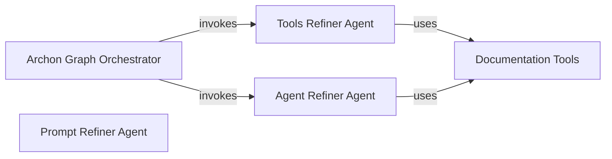

## Component Details

The Refiner Agents component is a collection of specialized AI agents designed to iteratively enhance and optimize different facets of the main AI agent. This includes refining the prompts used, the tools available to the agent, and the agent's core definition. It integrates with the Archon Graph Orchestrator for invocation and leverages Documentation Tools to gather necessary information for its refinement processes.

### Archon Graph Orchestrator
This component orchestrates the overall workflow of the Archon system, managing the flow between defining the scope, coding the AI agent, and handling user interactions. It utilizes various agents (reasoner, router, end conversation) and integrates with external services like Supabase and OpenAI.

**Related Classes/Methods**:

- <a href="https://github.com/coleam00/Archon/blob/master/iterations/v4-streamlit-ui-overhaul/archon/archon_graph.py#L85-L119" target="_blank" rel="noopener noreferrer">`archon.archon_graph:define_scope_with_reasoner` (85:119)</a>
- <a href="https://github.com/coleam00/Archon/blob/master/iterations/v4-streamlit-ui-overhaul/archon/archon_graph.py#L122-L152" target="_blank" rel="noopener noreferrer">`archon.archon_graph:coder_agent` (122:152)</a>
- <a href="https://github.com/coleam00/Archon/blob/master/iterations/v4-streamlit-ui-overhaul/archon/archon_graph.py#L155-L161" target="_blank" rel="noopener noreferrer">`archon.archon_graph:get_next_user_message` (155:161)</a>
- <a href="https://github.com/coleam00/Archon/blob/master/iterations/v4-streamlit-ui-overhaul/archon/archon_graph.py#L164-L180" target="_blank" rel="noopener noreferrer">`archon.archon_graph:route_user_message` (164:180)</a>
- <a href="https://github.com/coleam00/Archon/blob/master/iterations/v4-streamlit-ui-overhaul/archon/archon_graph.py#L183-L203" target="_blank" rel="noopener noreferrer">`archon.archon_graph:finish_conversation` (183:203)</a>
- <a href="https://github.com/coleam00/Archon/blob/master/iterations/v4-streamlit-ui-overhaul/archon/archon_graph.py#L79-L82" target="_blank" rel="noopener noreferrer">`archon.archon_graph:AgentState` (79:82)</a>

### Tools Refiner Agent
This component is responsible for refining the tools used by the AI agent. It interacts with documentation tools to retrieve, list, and get content from documentation pages to inform the refinement process.

**Related Classes/Methods**:

- <a href="https://github.com/coleam00/Archon/blob/master/iterations/v5-parallel-specialized-agents/archon/refiner_agents/tools_refiner_agent.py#L54-L66" target="_blank" rel="noopener noreferrer">`archon.refiner_agents.tools_refiner_agent:retrieve_relevant_documentation` (54:66)</a>
- <a href="https://github.com/coleam00/Archon/blob/master/iterations/v5-parallel-specialized-agents/archon/refiner_agents/tools_refiner_agent.py#L69-L77" target="_blank" rel="noopener noreferrer">`archon.refiner_agents.tools_refiner_agent:list_documentation_pages` (69:77)</a>
- <a href="https://github.com/coleam00/Archon/blob/master/iterations/v5-parallel-specialized-agents/archon/refiner_agents/tools_refiner_agent.py#L80-L92" target="_blank" rel="noopener noreferrer">`archon.refiner_agents.tools_refiner_agent:get_page_content` (80:92)</a>
- <a href="https://github.com/coleam00/Archon/blob/master/iterations/v5-parallel-specialized-agents/archon/refiner_agents/tools_refiner_agent.py#L42-L44" target="_blank" rel="noopener noreferrer">`archon.refiner_agents.tools_refiner_agent:ToolsRefinerDeps` (42:44)</a>
- <a href="https://github.com/coleam00/Archon/blob/master/iterations/v5-parallel-specialized-agents/archon/refiner_agents/tools_refiner_agent.py#L44-L49" target="_blank" rel="noopener noreferrer">`archon.refiner_agents.tools_refiner_agent:tools_refiner_agent` (44:49)</a>

### Agent Refiner Agent
This component focuses on refining the AI agent itself. Similar to the Tools Refiner, it uses documentation tools to gather necessary information for improving the agent's capabilities and behavior.

**Related Classes/Methods**:

- <a href="https://github.com/coleam00/Archon/blob/master/iterations/v5-parallel-specialized-agents/archon/refiner_agents/agent_refiner_agent.py#L54-L66" target="_blank" rel="noopener noreferrer">`archon.refiner_agents.agent_refiner_agent:retrieve_relevant_documentation` (54:66)</a>
- <a href="https://github.com/coleam00/Archon/blob/master/iterations/v5-parallel-specialized-agents/archon/refiner_agents/agent_refiner_agent.py#L69-L77" target="_blank" rel="noopener noreferrer">`archon.refiner_agents.agent_refiner_agent:list_documentation_pages` (69:77)</a>
- <a href="https://github.com/coleam00/Archon/blob/master/iterations/v5-parallel-specialized-agents/archon/refiner_agents/agent_refiner_agent.py#L80-L92" target="_blank" rel="noopener noreferrer">`archon.refiner_agents.agent_refiner_agent:get_page_content` (80:92)</a>
- <a href="https://github.com/coleam00/Archon/blob/master/iterations/v5-parallel-specialized-agents/archon/refiner_agents/agent_refiner_agent.py#L42-L44" target="_blank" rel="noopener noreferrer">`archon.refiner_agents.agent_refiner_agent:AgentRefinerDeps` (42:44)</a>
- <a href="https://github.com/coleam00/Archon/blob/master/iterations/v5-parallel-specialized-agents/archon/refiner_agents/agent_refiner_agent.py#L44-L49" target="_blank" rel="noopener noreferrer">`archon.refiner_agents.agent_refiner_agent:agent_refiner_agent` (44:49)</a>

### Documentation Tools
This component provides a set of utility functions for interacting with documentation. It includes tools for retrieving relevant documentation, listing available documentation pages, and fetching the content of specific pages.

**Related Classes/Methods**:

- <a href="https://github.com/coleam00/Archon/blob/master/iterations/v5-parallel-specialized-agents/archon/agent_tools.py#L24-L57" target="_blank" rel="noopener noreferrer">`archon.agent_tools.retrieve_relevant_documentation_tool` (24:57)</a>
- <a href="https://github.com/coleam00/Archon/blob/master/iterations/v5-parallel-specialized-agents/archon/agent_tools.py#L59-L84" target="_blank" rel="noopener noreferrer">`archon.agent_tools.list_documentation_pages_tool` (59:84)</a>
- <a href="https://github.com/coleam00/Archon/blob/master/iterations/v5-parallel-specialized-agents/archon/agent_tools.py#L86-L123" target="_blank" rel="noopener noreferrer">`archon.agent_tools.get_page_content_tool` (86:123)</a>

### Prompt Refiner Agent
This component is responsible for refining the prompt used by the AI agent.

**Related Classes/Methods**:

- <a href="https://github.com/coleam00/Archon/blob/master/iterations/v5-parallel-specialized-agents/archon/refiner_agents/prompt_refiner_agent.py#L30-L33" target="_blank" rel="noopener noreferrer">`archon.refiner_agents.prompt_refiner_agent:prompt_refiner_agent` (30:33)</a>

### [FAQ](https://github.com/CodeBoarding/GeneratedOnBoardings/tree/main?tab=readme-ov-file#faq)