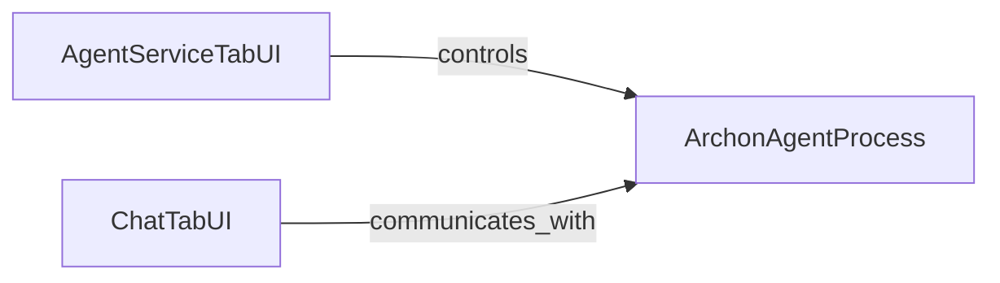

## Component Details

The `Streamlit UI - Agent Interaction & Service Control` subsystem provides the user-facing interfaces for interacting with and managing the Archon agent. It consists of two primary UI components: one for controlling the agent's underlying service (start/stop/monitor) and another for direct conversational interaction with the agent. These UI components interact with the core Archon agent logic, which runs as a separate process.

### AgentServiceTabUI
Manages the Streamlit user interface for controlling and monitoring the Archon agent service. It provides functionalities to start, stop, and restart the service, and displays its real-time output. This component also contains helper functions to check the service status and terminate processes on a specific port.

**Related Classes/Methods**:

- <a href="https://github.com/coleam00/Archon/blob/master/streamlit_pages/agent_service.py#L13-L230" target="_blank" rel="noopener noreferrer">`Archon.streamlit_pages.agent_service:agent_service_tab` (13:230)</a>
- <a href="https://github.com/coleam00/Archon/blob/master/streamlit_pages/agent_service.py#L24-L28" target="_blank" rel="noopener noreferrer">`Archon.streamlit_pages.agent_service:is_service_running` (24:28)</a>
- <a href="https://github.com/coleam00/Archon/blob/master/streamlit_pages/agent_service.py#L30-L68" target="_blank" rel="noopener noreferrer">`Archon.streamlit_pages.agent_service:kill_process_on_port` (30:68)</a>

### ChatTabUI
Provides the Streamlit-based conversational interface for users to interact with the Archon agent. It handles user input, maintains and displays chat history, and initiates the streaming of responses from the underlying Archon agent's core logic.

**Related Classes/Methods**:

- <a href="https://github.com/coleam00/Archon/blob/master/streamlit_pages/chat.py#L41-L86" target="_blank" rel="noopener noreferrer">`Archon.streamlit_pages.chat:chat_tab` (41:86)</a>
- <a href="https://github.com/coleam00/Archon/blob/master/streamlit_pages/chat.py#L17-L39" target="_blank" rel="noopener noreferrer">`Archon.streamlit_pages.chat:run_agent_with_streaming` (17:39)</a>

### ArchonAgentProcess
Represents the core Archon agent logic, which is designed to run as a separate process. This component encapsulates the agentic flow responsible for processing user queries, managing conversational state, and generating intelligent responses, often utilizing a graph-based architecture.

**Related Classes/Methods**:

- `archon.archon_graph:agentic_flow` (full file reference)

### [FAQ](https://github.com/CodeBoarding/GeneratedOnBoardings/tree/main?tab=readme-ov-file#faq)