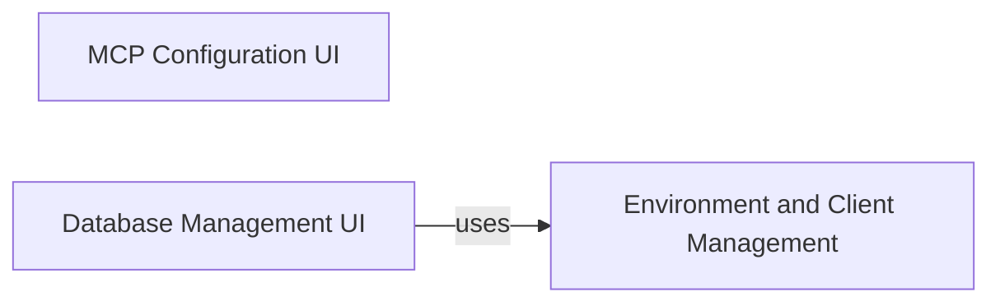

## Component Details

This graph outlines the structure and interactions of the Streamlit UI components responsible for configuration and management within the Archon system. The main flow involves users interacting with the MCP Configuration UI to set up their AI IDE and the Database Management UI to configure the Supabase database. Both of these UI components rely on the Environment and Client Management component to handle environment variables and client initialization, ensuring proper system setup and operation.

### MCP Configuration UI
Provides a Streamlit-based user interface for configuring the Multi-Client Protocol (MCP) server. It enables users to select their AI IDE (e.g., Windsurf, Cursor) and generates corresponding Python and Docker configurations, along with setup instructions. It also handles path resolution for the MCP server script and generates configuration strings based on the selected IDE.

**Related Classes/Methods**:

- <a href="https://github.com/coleam00/Archon/blob/master/streamlit_pages/mcp.py#L67-L172" target="_blank" rel="noopener noreferrer">`Archon.streamlit_pages.mcp:mcp_tab` (67:172)</a>
- <a href="https://github.com/coleam00/Archon/blob/master/streamlit_pages/mcp.py#L6-L18" target="_blank" rel="noopener noreferrer">`Archon.streamlit_pages.mcp:get_paths` (6:18)</a>
- <a href="https://github.com/coleam00/Archon/blob/master/streamlit_pages/mcp.py#L20-L65" target="_blank" rel="noopener noreferrer">`Archon.streamlit_pages.mcp:generate_mcp_config` (20:65)</a>

### Database Management UI
Offers a Streamlit interface for managing the Supabase database, specifically focusing on the 'site_pages' table. It checks for table existence, allows selection of vector dimensions for embeddings, displays generated SQL for table creation/recreation, and provides instructions for manual SQL execution in the Supabase SQL Editor. It also includes functionality to clear existing table data.

**Related Classes/Methods**:

- <a href="https://github.com/coleam00/Archon/blob/master/streamlit_pages/database.py#L59-L180" target="_blank" rel="noopener noreferrer">`Archon.streamlit_pages.database:database_tab` (59:180)</a>
- <a href="https://github.com/coleam00/Archon/blob/master/streamlit_pages/database.py#L9-L12" target="_blank" rel="noopener noreferrer">`Archon.streamlit_pages.database:load_sql_template` (9:12)</a>
- <a href="https://github.com/coleam00/Archon/blob/master/streamlit_pages/database.py#L14-L30" target="_blank" rel="noopener noreferrer">`Archon.streamlit_pages.database:get_supabase_sql_editor_url` (14:30)</a>
- <a href="https://github.com/coleam00/Archon/blob/master/streamlit_pages/database.py#L32-L57" target="_blank" rel="noopener noreferrer">`Archon.streamlit_pages.database:show_manual_sql_instructions` (32:57)</a>

### Environment and Client Management
Manages environment variables and profiles, providing a centralized mechanism for storing and retrieving configuration details. It also handles the initialization of external service clients (e.g., Supabase, OpenAI) based on these environment variables and provides utilities for logging and module reloading.

**Related Classes/Methods**:

- <a href="https://github.com/coleam00/Archon/blob/master/utils/utils.py#L24-L38" target="_blank" rel="noopener noreferrer">`Archon.utils.utils:write_to_log` (24:38)</a>
- <a href="https://github.com/coleam00/Archon/blob/master/utils/utils.py#L40-L75" target="_blank" rel="noopener noreferrer">`Archon.utils.utils:get_env_var` (40:75)</a>
- <a href="https://github.com/coleam00/Archon/blob/master/utils/utils.py#L77-L127" target="_blank" rel="noopener noreferrer">`Archon.utils.utils:save_env_var` (77:127)</a>
- <a href="https://github.com/coleam00/Archon/blob/master/utils/utils.py#L129-L145" target="_blank" rel="noopener noreferrer">`Archon.utils.utils:get_current_profile` (129:145)</a>
- <a href="https://github.com/coleam00/Archon/blob/master/utils/utils.py#L147-L187" target="_blank" rel="noopener noreferrer">`Archon.utils.utils:set_current_profile` (147:187)</a>
- <a href="https://github.com/coleam00/Archon/blob/master/utils/utils.py#L189-L207" target="_blank" rel="noopener noreferrer">`Archon.utils.utils:get_all_profiles` (189:207)</a>
- <a href="https://github.com/coleam00/Archon/blob/master/utils/utils.py#L209-L249" target="_blank" rel="noopener noreferrer">`Archon.utils.utils:create_profile` (209:249)</a>
- <a href="https://github.com/coleam00/Archon/blob/master/utils/utils.py#L251-L286" target="_blank" rel="noopener noreferrer">`Archon.utils.utils:delete_profile` (251:286)</a>
- <a href="https://github.com/coleam00/Archon/blob/master/utils/utils.py#L288-L319" target="_blank" rel="noopener noreferrer">`Archon.utils.utils:get_profile_env_vars` (288:319)</a>
- <a href="https://github.com/coleam00/Archon/blob/master/utils/utils.py#L321-L338" target="_blank" rel="noopener noreferrer">`Archon.utils.utils:log_node_execution` (321:338)</a>
- <a href="https://github.com/coleam00/Archon/blob/master/utils/utils.py#L361-L381" target="_blank" rel="noopener noreferrer">`Archon.utils.utils:reload_archon_graph` (361:381)</a>
- <a href="https://github.com/coleam00/Archon/blob/master/utils/utils.py#L383-L409" target="_blank" rel="noopener noreferrer">`Archon.utils.utils:get_clients` (383:409)</a>

### [FAQ](https://github.com/CodeBoarding/GeneratedOnBoardings/tree/main?tab=readme-ov-file#faq)