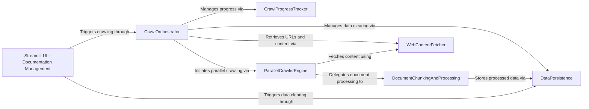

## Component Details

This subsystem provides a user interface for managing documentation within Archon. Its primary purpose is to enable users to initiate web crawls for documentation, clear existing documentation records, and monitor the progress of the documentation ingestion process. The main flow involves the Streamlit UI triggering the crawl orchestration, which then coordinates fetching content, processing it, and persisting it to the database, all while updating a progress tracker.

### Streamlit UI - Documentation Management
Provides a dedicated user interface for managing the documentation within Archon, allowing users to initiate crawls and clear existing documentation records. It displays the progress and status of documentation ingestion.

**Related Classes/Methods**:

- <a href="https://github.com/coleam00/Archon/blob/master/iterations/v5-parallel-specialized-agents/streamlit_pages/documentation.py#L10-L158" target="_blank" rel="noopener noreferrer">`streamlit_pages.documentation:documentation_tab` (10:158)</a>

### CrawlProgressTracker
Manages and tracks the progress of the web crawling operation, providing status updates and logging for the user interface.

**Related Classes/Methods**:

- <a href="https://github.com/coleam00/Archon/blob/master/iterations/v4-streamlit-ui-overhaul/archon/crawl_pydantic_ai_docs.py#L64-L141" target="_blank" rel="noopener noreferrer">`archon.crawl_pydantic_ai_docs.CrawlProgressTracker` (64:141)</a>
- <a href="https://github.com/coleam00/Archon/blob/master/iterations/v4-streamlit-ui-overhaul/archon/crawl_pydantic_ai_docs.py#L85-L94" target="_blank" rel="noopener noreferrer">`archon.crawl_pydantic_ai_docs.CrawlProgressTracker:log` (85:94)</a>
- <a href="https://github.com/coleam00/Archon/blob/master/iterations/v4-streamlit-ui-overhaul/archon/crawl_pydantic_ai_docs.py#L96-L104" target="_blank" rel="noopener noreferrer">`archon.crawl_pydantic_ai_docs.CrawlProgressTracker:start` (96:104)</a>
- <a href="https://github.com/coleam00/Archon/blob/master/iterations/v4-streamlit-ui-overhaul/archon/crawl_pydantic_ai_docs.py#L106-L116" target="_blank" rel="noopener noreferrer">`archon.crawl_pydantic_ai_docs.CrawlProgressTracker:complete` (106:116)</a>
- <a href="https://github.com/coleam00/Archon/blob/master/iterations/v4-streamlit-ui-overhaul/archon/crawl_pydantic_ai_docs.py#L118-L131" target="_blank" rel="noopener noreferrer">`archon.crawl_pydantic_ai_docs.CrawlProgressTracker.get_status` (118:131)</a>

### DocumentChunkingAndProcessing
Handles the splitting of raw document content into smaller, manageable chunks. It then processes each chunk to extract relevant metadata like title and summary, and generates vector embeddings for efficient retrieval.

**Related Classes/Methods**:

- <a href="https://github.com/coleam00/Archon/blob/master/iterations/v4-streamlit-ui-overhaul/archon/crawl_pydantic_ai_docs.py#L143-L186" target="_blank" rel="noopener noreferrer">`archon.crawl_pydantic_ai_docs.chunk_text` (143:186)</a>
- <a href="https://github.com/coleam00/Archon/blob/master/iterations/v4-streamlit-ui-overhaul/archon/crawl_pydantic_ai_docs.py#L188-L208" target="_blank" rel="noopener noreferrer">`archon.crawl_pydantic_ai_docs.get_title_and_summary` (188:208)</a>
- <a href="https://github.com/coleam00/Archon/blob/master/iterations/v4-streamlit-ui-overhaul/archon/crawl_pydantic_ai_docs.py#L210-L220" target="_blank" rel="noopener noreferrer">`archon.crawl_pydantic_ai_docs.get_embedding` (210:220)</a>
- <a href="https://github.com/coleam00/Archon/blob/master/iterations/v4-streamlit-ui-overhaul/archon/crawl_pydantic_ai_docs.py#L222-L246" target="_blank" rel="noopener noreferrer">`archon.crawl_pydantic_ai_docs.process_chunk` (222:246)</a>
- <a href="https://github.com/coleam00/Archon/blob/master/iterations/v4-streamlit-ui-overhaul/archon/crawl_pydantic_ai_docs.py#L55-L62" target="_blank" rel="noopener noreferrer">`archon.crawl_pydantic_ai_docs.ProcessedChunk` (55:62)</a>

### DataPersistence
Manages the storage of processed document chunks into the Supabase database. It also provides functionality to clear existing records, ensuring data freshness before a new crawl.

**Related Classes/Methods**:

- <a href="https://github.com/coleam00/Archon/blob/master/iterations/v4-streamlit-ui-overhaul/archon/crawl_pydantic_ai_docs.py#L248-L266" target="_blank" rel="noopener noreferrer">`archon.crawl_pydantic_ai_docs.insert_chunk` (248:266)</a>
- <a href="https://github.com/coleam00/Archon/blob/master/iterations/v4-streamlit-ui-overhaul/archon/crawl_pydantic_ai_docs.py#L421-L429" target="_blank" rel="noopener noreferrer">`archon.crawl_pydantic_ai_docs.clear_existing_records` (421:429)</a>

### WebContentFetcher
Responsible for retrieving the sitemap and fetching the raw HTML content from specified URLs. It also converts the fetched HTML into a clean markdown format suitable for further processing.

**Related Classes/Methods**:

- <a href="https://github.com/coleam00/Archon/blob/master/iterations/v4-streamlit-ui-overhaul/archon/crawl_pydantic_ai_docs.py#L312-L330" target="_blank" rel="noopener noreferrer">`archon.crawl_pydantic_ai_docs.fetch_url_content` (312:330)</a>
- <a href="https://github.com/coleam00/Archon/blob/master/iterations/v4-streamlit-ui-overhaul/archon/crawl_pydantic_ai_docs.py#L402-L419" target="_blank" rel="noopener noreferrer">`archon.crawl_pydantic_ai_docs.get_pydantic_ai_docs_urls` (402:419)</a>

### ParallelCrawlerEngine
Orchestrates the parallel crawling of multiple URLs, managing concurrency to efficiently fetch and process web content. It delegates the actual content fetching and document processing tasks.

**Related Classes/Methods**:

- <a href="https://github.com/coleam00/Archon/blob/master/iterations/v4-streamlit-ui-overhaul/archon/crawl_pydantic_ai_docs.py#L332-L400" target="_blank" rel="noopener noreferrer">`archon.crawl_pydantic_ai_docs.crawl_parallel_with_requests` (332:400)</a>
- <a href="https://github.com/coleam00/Archon/blob/master/iterations/v4-streamlit-ui-overhaul/archon/crawl_pydantic_ai_docs.py#L337-L390" target="_blank" rel="noopener noreferrer">`archon.crawl_pydantic_ai_docs.crawl_parallel_with_requests.process_url` (337:390)</a>

### CrawlOrchestrator
The central control component that initiates and manages the entire web crawling workflow. It coordinates between fetching URLs, clearing old data, executing the parallel crawl, and updating the progress tracker.

**Related Classes/Methods**:

- <a href="https://github.com/coleam00/Archon/blob/master/iterations/v4-streamlit-ui-overhaul/archon/crawl_pydantic_ai_docs.py#L431-L486" target="_blank" rel="noopener noreferrer">`archon.crawl_pydantic_ai_docs.main_with_requests` (431:486)</a>
- <a href="https://github.com/coleam00/Archon/blob/master/iterations/v4-streamlit-ui-overhaul/archon/crawl_pydantic_ai_docs.py#L488-L505" target="_blank" rel="noopener noreferrer">`archon.crawl_pydantic_ai_docs.start_crawl_with_requests` (488:505)</a>

### [FAQ](https://github.com/CodeBoarding/GeneratedOnBoardings/tree/main?tab=readme-ov-file#faq)