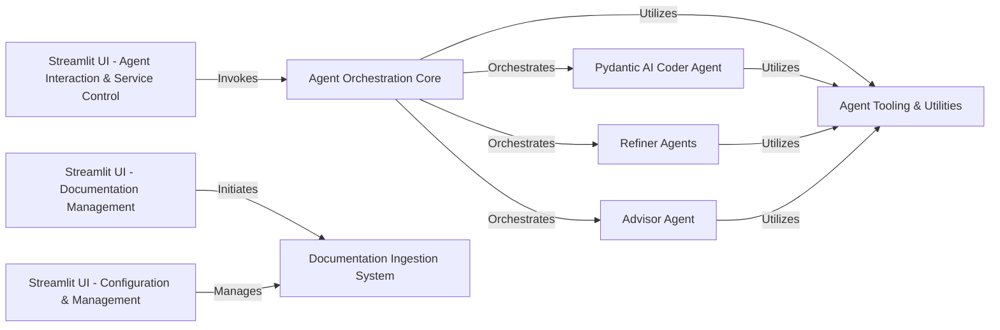

## Component Details

This architecture analysis describes the high-level data flow and component interactions within the Archon project. The system is centered around an Agent Orchestration Core that coordinates various AI agents (Coder, Refiners, Advisor) to achieve specific tasks, primarily code generation and refinement. A robust Documentation Ingestion System feeds relevant information to these agents via a shared Agent Tooling & Utilities layer. User interaction and system management are handled through a set of Streamlit-based User Interface components, allowing for configuration, agent interaction, and documentation management.

### Agent Orchestration Core
The central control module responsible for initiating and coordinating various AI agents (Coder, Advisor, Refiners) and defining their operational scope within the Archon system. It manages the overall workflow of agent creation and refinement, routing user messages and finishing conversations.

**Related Classes/Methods**:

- <a href="https://github.com/coleam00/Archon/blob/master/archon/archon_graph.py#L83-L117" target="_blank" rel="noopener noreferrer">`Archon.archon.archon_graph:define_scope_with_reasoner` (83:117)</a>
- <a href="https://github.com/coleam00/Archon/blob/master/archon/archon_graph.py#L120-L143" target="_blank" rel="noopener noreferrer">`Archon.archon.archon_graph:advisor_with_examples` (120:143)</a>
- <a href="https://github.com/coleam00/Archon/blob/master/archon/archon_graph.py#L146-L204" target="_blank" rel="noopener noreferrer">`Archon.archon.archon_graph:coder_agent` (146:204)</a>
- <a href="https://github.com/coleam00/Archon/blob/master/archon/archon_graph.py#L234-L245" target="_blank" rel="noopener noreferrer">`Archon.archon.archon_graph:refine_prompt` (234:245)</a>
- <a href="https://github.com/coleam00/Archon/blob/master/archon/archon_graph.py#L248-L266" target="_blank" rel="noopener noreferrer">`Archon.archon.archon_graph:refine_tools` (248:266)</a>
- <a href="https://github.com/coleam00/Archon/blob/master/archon/archon_graph.py#L269-L286" target="_blank" rel="noopener noreferrer">`Archon.archon.archon_graph:refine_agent` (269:286)</a>
- <a href="https://github.com/coleam00/Archon/blob/master/archon/archon_graph.py#L216-L231" target="_blank" rel="noopener noreferrer">`Archon.archon.archon_graph:route_user_message` (216:231)</a>
- <a href="https://github.com/coleam00/Archon/blob/master/archon/archon_graph.py#L289-L309" target="_blank" rel="noopener noreferrer">`Archon.archon.archon_graph:finish_conversation` (289:309)</a>

### Pydantic AI Coder Agent
An intelligent agent specialized in generating code, primarily by interacting with and leveraging documentation. It is designed to produce structured outputs, likely using Pydantic models, and is a core component in the agent creation process.

**Related Classes/Methods**:

- <a href="https://github.com/coleam00/Archon/blob/master/archon/pydantic_ai_coder.py#L44-L49" target="_blank" rel="noopener noreferrer">`Archon.archon.pydantic_ai_coder:pydantic_ai_coder` (44:49)</a>
- <a href="https://github.com/coleam00/Archon/blob/master/archon/pydantic_ai_coder.py#L41-L45" target="_blank" rel="noopener noreferrer">`Archon.archon.pydantic_ai_coder:PydanticAIDeps` (41:45)</a>
- <a href="https://github.com/coleam00/Archon/blob/master/archon/pydantic_ai_coder.py#L67-L78" target="_blank" rel="noopener noreferrer">`Archon.archon.pydantic_ai_coder:retrieve_relevant_documentation` (67:78)</a>
- <a href="https://github.com/coleam00/Archon/blob/master/archon/pydantic_ai_coder.py#L81-L88" target="_blank" rel="noopener noreferrer">`Archon.archon.pydantic_ai_coder:list_documentation_pages` (81:88)</a>
- <a href="https://github.com/coleam00/Archon/blob/master/archon/pydantic_ai_coder.py#L91-L102" target="_blank" rel="noopener noreferrer">`Archon.archon.pydantic_ai_coder:get_page_content` (91:102)</a>

### Agent Tooling & Utilities
A foundational library providing essential tools and utility functions for various agents, including capabilities for documentation retrieval, page content access, file content access, and text embedding generation. These tools abstract away the complexities of interacting with external services like Supabase and OpenAI.

**Related Classes/Methods**:

- <a href="https://github.com/coleam00/Archon/blob/master/iterations/v5-parallel-specialized-agents/archon/agent_tools.py#L12-L22" target="_blank" rel="noopener noreferrer">`archon.agent_tools:get_embedding` (12:22)</a>
- <a href="https://github.com/coleam00/Archon/blob/master/iterations/v5-parallel-specialized-agents/archon/agent_tools.py#L24-L57" target="_blank" rel="noopener noreferrer">`archon.agent_tools:retrieve_relevant_documentation_tool` (24:57)</a>
- <a href="https://github.com/coleam00/Archon/blob/master/iterations/v5-parallel-specialized-agents/archon/agent_tools.py#L59-L84" target="_blank" rel="noopener noreferrer">`archon.agent_tools:list_documentation_pages_tool` (59:84)</a>
- <a href="https://github.com/coleam00/Archon/blob/master/iterations/v5-parallel-specialized-agents/archon/agent_tools.py#L86-L123" target="_blank" rel="noopener noreferrer">`archon.agent_tools:get_page_content_tool` (86:123)</a>
- `archon.agent_tools:get_file_content_tool` (full file reference)

### Documentation Ingestion System
Manages the entire lifecycle of documentation processing, from crawling and extracting content to chunking, embedding, and storing it for efficient retrieval by AI agents. It handles the interaction with external documentation sources and the Supabase database.

**Related Classes/Methods**:

- <a href="https://github.com/coleam00/Archon/blob/master/archon/crawl_pydantic_ai_docs.py#L64-L141" target="_blank" rel="noopener noreferrer">`Archon.archon.crawl_pydantic_ai_docs:CrawlProgressTracker` (64:141)</a>
- <a href="https://github.com/coleam00/Archon/blob/master/archon/crawl_pydantic_ai_docs.py#L143-L186" target="_blank" rel="noopener noreferrer">`Archon.archon.crawl_pydantic_ai_docs:chunk_text` (143:186)</a>
- <a href="https://github.com/coleam00/Archon/blob/master/archon/crawl_pydantic_ai_docs.py#L188-L208" target="_blank" rel="noopener noreferrer">`Archon.archon.crawl_pydantic_ai_docs:get_title_and_summary` (188:208)</a>
- <a href="https://github.com/coleam00/Archon/blob/master/archon/crawl_pydantic_ai_docs.py#L210-L220" target="_blank" rel="noopener noreferrer">`Archon.archon.crawl_pydantic_ai_docs:get_embedding` (210:220)</a>
- <a href="https://github.com/coleam00/Archon/blob/master/archon/crawl_pydantic_ai_docs.py#L222-L246" target="_blank" rel="noopener noreferrer">`Archon.archon.crawl_pydantic_ai_docs:process_chunk` (222:246)</a>
- <a href="https://github.com/coleam00/Archon/blob/master/archon/crawl_pydantic_ai_docs.py#L248-L266" target="_blank" rel="noopener noreferrer">`Archon.archon.crawl_pydantic_ai_docs:insert_chunk` (248:266)</a>
- <a href="https://github.com/coleam00/Archon/blob/master/archon/crawl_pydantic_ai_docs.py#L268-L310" target="_blank" rel="noopener noreferrer">`Archon.archon.crawl_pydantic_ai_docs:process_and_store_document` (268:310)</a>
- <a href="https://github.com/coleam00/Archon/blob/master/archon/crawl_pydantic_ai_docs.py#L332-L402" target="_blank" rel="noopener noreferrer">`Archon.archon.crawl_pydantic_ai_docs:crawl_parallel_with_requests` (332:402)</a>
- <a href="https://github.com/coleam00/Archon/blob/master/archon/crawl_pydantic_ai_docs.py#L433-L488" target="_blank" rel="noopener noreferrer">`Archon.archon.crawl_pydantic_ai_docs:main_with_requests` (433:488)</a>
- <a href="https://github.com/coleam00/Archon/blob/master/archon/crawl_pydantic_ai_docs.py#L490-L507" target="_blank" rel="noopener noreferrer">`Archon.archon.crawl_pydantic_ai_docs:start_crawl_with_requests` (490:507)</a>
- <a href="https://github.com/coleam00/Archon/blob/master/iterations/v4-streamlit-ui-overhaul/archon/crawl_pydantic_ai_docs.py#L421-L429" target="_blank" rel="noopener noreferrer">`archon.crawl_pydantic_ai_docs:clear_existing_records` (421:429)</a>
- <a href="https://github.com/coleam00/Archon/blob/master/iterations/v4-streamlit-ui-overhaul/archon/crawl_pydantic_ai_docs.py#L402-L419" target="_blank" rel="noopener noreferrer">`archon.crawl_pydantic_ai_docs:get_pydantic_ai_docs_urls` (402:419)</a>

### Refiner Agents
A collection of AI agents dedicated to enhancing and optimizing various aspects of the AI agent being built, including refining the prompt, the tools used, and the agent's definition itself. These agents provide iterative improvement capabilities.

**Related Classes/Methods**:

- <a href="https://github.com/coleam00/Archon/blob/master/iterations/v5-parallel-specialized-agents/archon/refiner_agents/tools_refiner_agent.py#L44-L49" target="_blank" rel="noopener noreferrer">`archon.refiner_agents.tools_refiner_agent:tools_refiner_agent` (44:49)</a>
- <a href="https://github.com/coleam00/Archon/blob/master/iterations/v5-parallel-specialized-agents/archon/refiner_agents/tools_refiner_agent.py#L42-L44" target="_blank" rel="noopener noreferrer">`archon.refiner_agents.tools_refiner_agent:ToolsRefinerDeps` (42:44)</a>
- <a href="https://github.com/coleam00/Archon/blob/master/iterations/v5-parallel-specialized-agents/archon/refiner_agents/agent_refiner_agent.py#L44-L49" target="_blank" rel="noopener noreferrer">`archon.refiner_agents.agent_refiner_agent:agent_refiner_agent` (44:49)</a>
- <a href="https://github.com/coleam00/Archon/blob/master/iterations/v5-parallel-specialized-agents/archon/refiner_agents/agent_refiner_agent.py#L42-L44" target="_blank" rel="noopener noreferrer">`archon.refiner_agents.agent_refiner_agent:AgentRefinerDeps` (42:44)</a>
- <a href="https://github.com/coleam00/Archon/blob/master/iterations/v5-parallel-specialized-agents/archon/refiner_agents/prompt_refiner_agent.py#L30-L33" target="_blank" rel="noopener noreferrer">`archon.refiner_agents.prompt_refiner_agent:prompt_refiner_agent` (30:33)</a>

### Advisor Agent
An AI agent designed to provide guidance and recommendations, potentially by leveraging a knowledge base of examples and pre-built tools/MCP servers. It helps in establishing a starting point for the AI agent creation process.

**Related Classes/Methods**:

- <a href="https://github.com/coleam00/Archon/blob/master/iterations/v6-tool-library-integration/archon/advisor_agent.py#L44-L49" target="_blank" rel="noopener noreferrer">`archon.advisor_agent:advisor_agent` (44:49)</a>
- <a href="https://github.com/coleam00/Archon/blob/master/iterations/v6-tool-library-integration/archon/advisor_agent.py#L37-L38" target="_blank" rel="noopener noreferrer">`archon.advisor_agent:AdvisorDeps` (37:38)</a>
- <a href="https://github.com/coleam00/Archon/blob/master/iterations/v6-tool-library-integration/archon/advisor_agent.py#L60-L70" target="_blank" rel="noopener noreferrer">`archon.advisor_agent:get_file_content` (60:70)</a>

### Streamlit UI - Configuration & Management
Provides the user interface for managing various aspects of the Archon system, including Multi-Component Project (MCP) configurations, database interactions, and environment variable settings. It allows users to set up and monitor the system.

**Related Classes/Methods**:

- <a href="https://github.com/coleam00/Archon/blob/master/streamlit_pages/mcp.py#L67-L172" target="_blank" rel="noopener noreferrer">`Archon.streamlit_pages.mcp:mcp_tab` (67:172)</a>
- <a href="https://github.com/coleam00/Archon/blob/master/streamlit_pages/mcp.py#L6-L18" target="_blank" rel="noopener noreferrer">`Archon.streamlit_pages.mcp:get_paths` (6:18)</a>
- <a href="https://github.com/coleam00/Archon/blob/master/streamlit_pages/mcp.py#L20-L65" target="_blank" rel="noopener noreferrer">`Archon.streamlit_pages.mcp:generate_mcp_config` (20:65)</a>
- <a href="https://github.com/coleam00/Archon/blob/master/streamlit_pages/database.py#L59-L180" target="_blank" rel="noopener noreferrer">`Archon.streamlit_pages.database:database_tab` (59:180)</a>
- <a href="https://github.com/coleam00/Archon/blob/master/streamlit_pages/database.py#L9-L12" target="_blank" rel="noopener noreferrer">`Archon.streamlit_pages.database:load_sql_template` (9:12)</a>
- <a href="https://github.com/coleam00/Archon/blob/master/streamlit_pages/database.py#L14-L30" target="_blank" rel="noopener noreferrer">`Archon.streamlit_pages.database:get_supabase_sql_editor_url` (14:30)</a>
- <a href="https://github.com/coleam00/Archon/blob/master/streamlit_pages/database.py#L32-L57" target="_blank" rel="noopener noreferrer">`Archon.streamlit_pages.database:show_manual_sql_instructions` (32:57)</a>

### Streamlit UI - Agent Interaction & Service Control
Offers user interfaces for direct interaction with Archon agents through a chat interface and for monitoring and controlling the underlying agent services. This component allows users to initiate and observe the agent's execution.

**Related Classes/Methods**:

- <a href="https://github.com/coleam00/Archon/blob/master/streamlit_pages/agent_service.py#L13-L230" target="_blank" rel="noopener noreferrer">`Archon.streamlit_pages.agent_service:agent_service_tab` (13:230)</a>
- <a href="https://github.com/coleam00/Archon/blob/master/streamlit_pages/agent_service.py#L24-L28" target="_blank" rel="noopener noreferrer">`Archon.streamlit_pages.agent_service:is_service_running` (24:28)</a>
- <a href="https://github.com/coleam00/Archon/blob/master/streamlit_pages/agent_service.py#L30-L68" target="_blank" rel="noopener noreferrer">`Archon.streamlit_pages.agent_service:kill_process_on_port` (30:68)</a>
- <a href="https://github.com/coleam00/Archon/blob/master/streamlit_pages/chat.py#L41-L86" target="_blank" rel="noopener noreferrer">`Archon.streamlit_pages.chat:chat_tab` (41:86)</a>
- <a href="https://github.com/coleam00/Archon/blob/master/streamlit_pages/chat.py#L17-L39" target="_blank" rel="noopener noreferrer">`Archon.streamlit_pages.chat:run_agent_with_streaming` (17:39)</a>

### Streamlit UI - Documentation Management
Provides a dedicated user interface for managing the documentation within Archon, allowing users to initiate crawls and clear existing documentation records. It displays the progress and status of documentation ingestion.

**Related Classes/Methods**:

- <a href="https://github.com/coleam00/Archon/blob/master/streamlit_pages/documentation.py#L10-L158" target="_blank" rel="noopener noreferrer">`Archon.streamlit_pages.documentation:documentation_tab` (10:158)</a>

### [FAQ](https://github.com/CodeBoarding/GeneratedOnBoardings/tree/main?tab=readme-ov-file#faq)