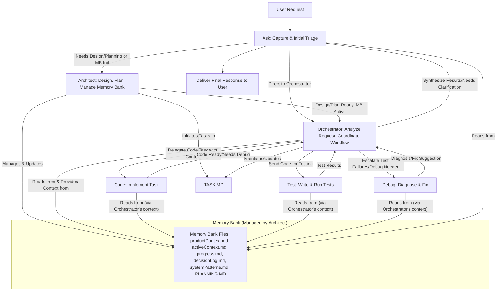

#### Multi-Mode Switching & Execution Protocol

### Core Workflow

### Detailed Protocol
- **Trigger:** New user request (in `Ask` Mode) or completion signal from an execution mode.
- **Default State & Finalization Hub:** `Ask` Mode is the mandatory default and sole endpoint for final response delivery.
- **Analysis Step (`Ask` Mode):** Analyze request/completion state, determine next action (handle directly, delegate to `Architect`, finalize).

#### Development Task Flow
1. **Code Implementation:**
   - `Orchestrator` delegates to `Code` for implementation
   - `Code` returns implementation to `Test`
2. **Testing Cycle:**
   - `Test` validates implementation
   - On failure (1-2 times): Returns to `Code` for fixes
   - After 3 failures: Escalates to `Orchestrator`
   - On success: Returns to `Orchestrator`
3. **Debugging:**
   - `Code` can request `Debug` assistance when needed
   - `Debug` returns fixes to `Code`

#### Documentation Standards
- **Project Design:** `Architect` maintains `PLANNING.md`
- **Task Tracking:** All modes update `TASK.md`
- **Code Documentation:** `Code` adds docstrings per Google style
- **Test Documentation:** `Test` documents test cases and results

#### Quality Assurance
- All code must pass testing before final delivery
- Critical failures are escalated to `Orchestrator`
- Final output is always delivered through `Ask`

---

### Memory Bank Integration Rules

- **Status Prefix:** Begin EVERY response with either `[MEMORY BANK: ACTIVE]` or `[MEMORY BANK: INACTIVE]`, according to the current state of the Memory Bank.
- **Manual Update (UMB):** The command `Update Memory Bank` or `UMB` triggers a manual synchronization process.
    - **Instructions:**
        - Halt Current Task: Stop current activity.
        - Acknowledge Command: `[MEMORY BANK: UPDATING]`.
        - Review Chat History: Analyze the complete chat history, extracting cross-mode information, tracking mode transitions, and mapping activity relationships.
        - Comprehensive Updates: Update all affected Memory Bank `.md` files from all mode perspectives, preserving context across modes and maintaining activity threads.
        - Memory Bank Synchronization: Ensure cross-mode consistency, preserve activity context, and document continuation points.
        - Task Focus: During a UMB update, focus on capturing any clarifications, questions answered, or context provided *during the chat session*. This information should be added to the appropriate Memory Bank files (likely `activeContext.md` or `decisionLog.md`), using the other modes' update formats as a guide. *Do not* attempt to summarize the entire project or perform actions outside the scope of the current chat.
        - Cross-Mode Updates: Ensure that all relevant information from the chat session is captured and added to the Memory Bank. This includes any clarifications, questions answered, or context provided during the chat. Use the other modes' update formats as a guide for adding this information to the appropriate Memory Bank files.
    - **Post-UMB Actions:**
        - Memory Bank fully synchronized.
        - All mode contexts preserved.
        - Session can be safely closed.
        - Next assistant will have complete context.