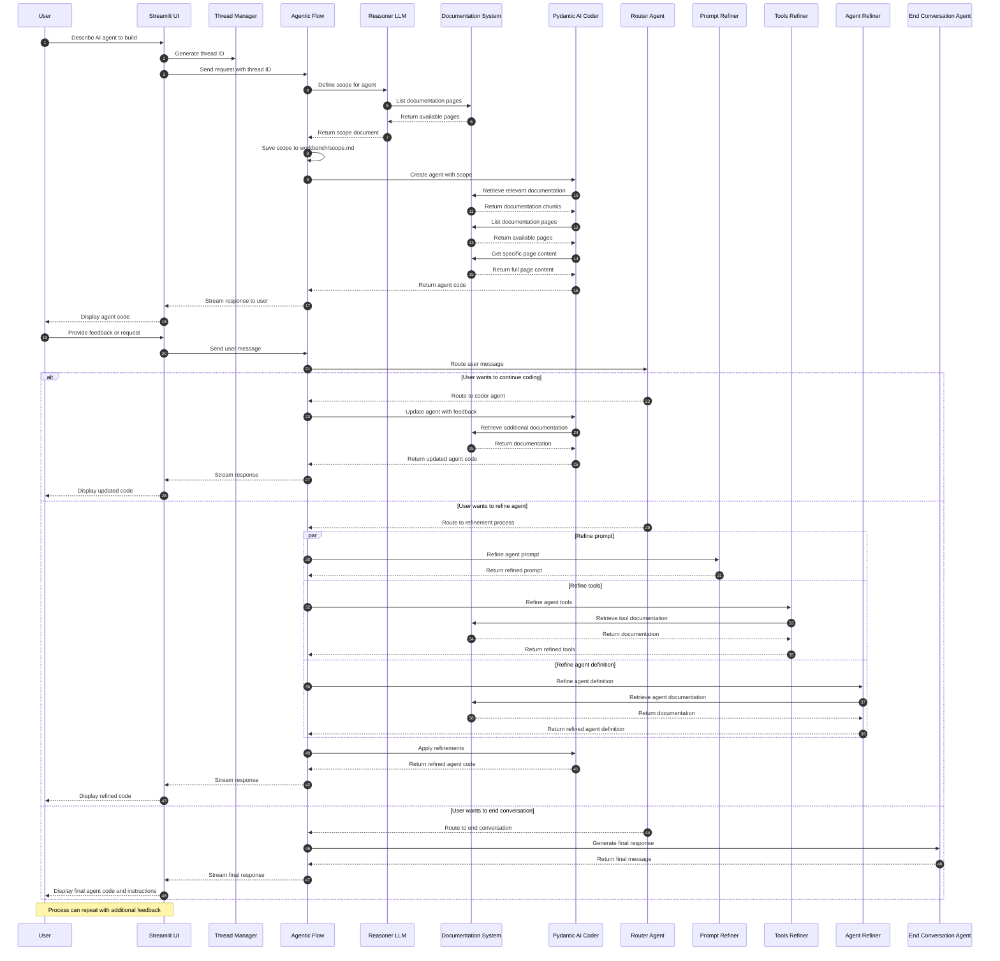

# Archon Chat Process - Sequence Diagram

This diagram illustrates the temporal flow of interactions between components in the Archon Chat process, showing how the system helps users build AI agents using Pydantic AI.

## Detailed Sequence Diagram

## Key Components and Interactions

1. **User and UI Layer**:

   - User interacts with the Streamlit UI
   - UI manages the conversation history and thread ID

2. **Workflow Orchestration**:

   - Agentic Flow (LangGraph) coordinates the entire process
   - Router Agent determines the next steps based on user messages

3. **Agent Creation Process**:

   - Reasoner LLM defines the scope and architecture
   - Pydantic AI Coder implements the agent code
   - Documentation System provides relevant information

4. **Refinement Process**:

   - Prompt Refiner improves the agent's system prompt
   - Tools Refiner enhances the agent's tools
   - Agent Refiner optimizes the agent definition

5. **Conversation Flow**:
   - Initial request → Scope definition → Agent creation
   - Feedback loop: Continue coding, Refine agent, or End conversation
   - Final response with instructions for using the agent

This sequence diagram captures the temporal flow of the Archon Chat process, showing how different components interact over time to create and refine an AI agent based on the user's requirements.
