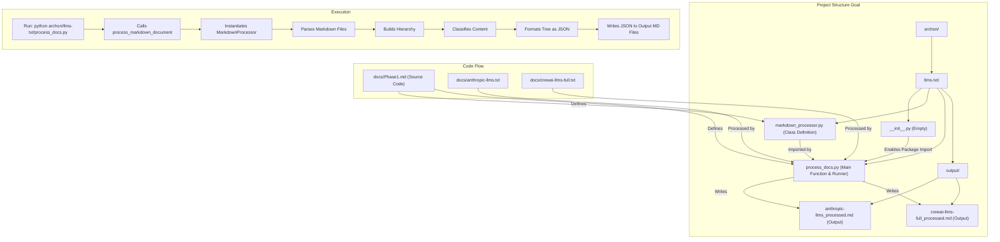

# Phase 1 Implementation Plan: Hierarchical RAG Document Processing

This plan outlines the steps to implement the Phase 1 document processing pipeline described in `docs/Phase1.md`. The goal is to create Python scripts within the `archon/llms-txt/` directory that parse Markdown files, build a hierarchical structure, classify content, and output the resulting structure as JSON within new Markdown files.

**Plan Steps:**

1.  **Create Core Processing Module:**
    *   Create a new Python file: `archon/llms-txt/markdown_processor.py`.
    *   This file will contain the `MarkdownProcessor` class, including all its methods (`__init__`, `parse_document`, `build_hierarchy_tree`, `_determine_section_type`, `classify_content`, `apply_classification`) based on the code provided in `docs/Phase1.md`.
    *   Required imports (`re`, `markdown_it`, `json`, `os`) will be included.

2.  **Create Main Execution Script:**
    *   Create a new Python file: `archon/llms-txt/process_docs.py`.
    *   This script will:
        *   Import `MarkdownProcessor` from `.markdown_processor`.
        *   Import `json` and `os`.
        *   Include the `process_markdown_document` function from `docs/Phase1.md`.
        *   Implement an `if __name__ == "__main__":` block to:
            *   Define input file paths relative to the script's location (e.g., `../../docs/anthropic-llms.txt`, `../../docs/crewai-llms-full.txt`).
            *   Define an output directory path within the `archon/llms-txt/` folder (e.g., `output/`).
            *   Ensure the output directory exists using `os.makedirs(output_dir, exist_ok=True)`.
            *   Define output file paths for the processed results (e.g., `output/anthropic-llms_processed.md`).
            *   Iterate through input files:
                *   Call `process_markdown_document` to obtain the hierarchical tree (as a Python dictionary).
                *   Convert the dictionary to a formatted JSON string (`json.dumps(tree, indent=2)`).
                *   Write this JSON string into the corresponding output Markdown file, enclosed in a JSON code block (```json ... ```).

3.  **Create Package Initializer:**
    *   Create an empty file `archon/llms-txt/__init__.py` to designate the directory as a Python package, enabling relative imports.

**Visual Plan (Mermaid):**



**Next Steps:**

Proceed with implementing this plan by creating the specified files and code.