# Phase 2: Chunking Strategy Implementation Plan

## Overview

Building on the document processing pipeline from Phase 1, this plan outlines the implementation of context-aware chunking strategies that preserve hierarchical relationships in markdown documentation. The goal is to create intelligent chunks that maintain contextual information and cross-references for more effective retrieval.

## 2.1 Context-Aware Chunking

This component implements differential chunking based on content type:

```python
class HierarchicalChunker:
    def __init__(self, max_chunk_size=1000, overlap_size=200):
        self.max_chunk_size = max_chunk_size
        self.overlap_size = overlap_size
        
    def create_chunks(self, document_tree):
        """Create context-aware chunks based on content type and hierarchy"""
        chunks = []
        self._process_node(document_tree, [], chunks)
        return chunks
        
    def _process_node(self, node, ancestor_path, chunks):
        """Process a node in the document tree to create appropriate chunks"""
        # Skip empty nodes
        if not node:
            return
            
        # Build current path including this node
        current_path = ancestor_path.copy()
        if node.get("title"):
            current_path.append({
                "title": node["title"],
                "level": node.get("level", 0)
            })
            
        # Process based on content type
        content_type = node.get("metadata", {}).get("content_type")
        
        if content_type == "link_list":
            # Keep link collections together under their parent header
            chunks.append(self._create_chunk(node, current_path, "link_list"))
            
        elif content_type == "code_example":
            # Maintain atomic code examples as single chunks
            chunks.append(self._create_chunk(node, current_path, "code_example"))
            
        elif content_type == "descriptive_text":
            # Apply semantic chunking for descriptive content
            self._chunk_descriptive_content(node, current_path, chunks)
            
        elif content_type == "introduction":
            # Keep introductions as a single chunk
            chunks.append(self._create_chunk(node, current_path, "introduction"))
            
        elif content_type == "table_based":
            # Keep tables together
            chunks.append(self._create_chunk(node, current_path, "table_based"))
            
        else:
            # Default chunking for other content types
            if node.get("content"):
                chunks.append(self._create_chunk(node, current_path, "default"))
        
        # Process children recursively
        for child in node.get("children", []):
            self._process_node(child, current_path, chunks)
    
    def _create_chunk(self, node, path, chunk_type):
        """Create a chunk with hierarchical context"""
        return {
            "content": node.get("content", ""),
            "title": node.get("title"),
            "type": chunk_type,
            "hierarchy_path": path,
            "metadata": {
                "section_type": node.get("metadata", {}).get("section_type", "General"),
                "content_type": node.get("metadata", {}).get("content_type"),
                "header_level": node.get("level", 0)
            }
        }
        
    def _chunk_descriptive_content(self, node, path, chunks):
        """Create semantic chunks for descriptive content with overlap"""
        content = node.get("content", "")
        
        # If content is small enough, keep it as a single chunk
        if len(content) <= self.max_chunk_size:
            chunks.append(self._create_chunk(node, path, "descriptive_text"))
            return
            
        # Split into paragraphs first
        paragraphs = re.split(r'\n\s*\n', content)
        
        current_chunk = ""
        
        for paragraph in paragraphs:
            # If adding this paragraph would exceed max size, create a chunk
            if len(current_chunk) + len(paragraph) > self.max_chunk_size and current_chunk:
                # Create a chunk with the current content
                chunk_node = node.copy()
                chunk_node["content"] = current_chunk
                chunks.append(self._create_chunk(chunk_node, path, "descriptive_text"))
                
                # Start new chunk with overlap
                overlap_words = current_chunk.split()[-self.overlap_size:]
                current_chunk = " ".join(overlap_words) + "\n\n" + paragraph
            else:
                # Add paragraph to current chunk
                if current_chunk:
                    current_chunk += "\n\n" + paragraph
                else:
                    current_chunk = paragraph
        
        # Add the final chunk if there's content left
        if current_chunk:
            chunk_node = node.copy()
            chunk_node["content"] = current_chunk
            chunks.append(self._create_chunk(chunk_node, path, "descriptive_text"))
```

### Chunking Strategies by Content Type

- **Link Collections**: Kept together under their parent header
- **Code Examples**: Maintained as atomic units (never split)
- **Descriptive Text**: Apply semantic chunking with paragraph-aware splitting and overlap
- **Introduction Sections**: Preserved as single chunks
- **Table-Based Content**: Maintained as cohesive units

## 2.2 Hierarchy Preservation

This component enriches chunks with hierarchical context:

```python
def add_hierarchical_context(self, chunks):
    """Add formatted hierarchical path and context to chunks"""
    enhanced_chunks = []
    
    for chunk in chunks:
        # Create a formatted header path
        path = chunk.get("hierarchy_path", [])
        formatted_path = " > ".join([p.get("title", "") for p in path if p.get("title")])
        
        # Create enhanced content with header context
        enhanced_content = f"Context: {formatted_path}\n\n"
        
        # Add the original title as a header if it exists and isn't already in the content
        if chunk.get("title") and not chunk.get("content", "").startswith(f"# {chunk.get('title')}"):
            header_prefix = "#" * max(1, chunk.get("metadata", {}).get("header_level", 1))
            enhanced_content += f"{header_prefix} {chunk.get('title')}\n\n"
            
        # Add the original content
        enhanced_content += chunk.get("content", "")
        
        # Update the chunk
        enhanced_chunk = chunk.copy()
        enhanced_chunk["enhanced_content"] = enhanced_content
        enhanced_chunk["formatted_path"] = formatted_path
        enhanced_chunk["metadata"]["hierarchy_levels"] = [p.get("level", 0) for p in path if p.get("title")]
        
        enhanced_chunks.append(enhanced_chunk)
    
    return enhanced_chunks
```

### Key Hierarchy Preservation Features

- Embedding full ancestor path in each chunk (e.g., "Pydantic > API Documentation > Fields")
- Preserving header levels in metadata
- Including contextual information in chunk content
- Maintaining clear relationship to original document structure

## 2.3 Cross-Reference Handling

This component identifies and tracks related sections:

```python
def establish_cross_references(self, chunks):
    """Create relationships between related chunks"""
    # Create a mapping of section titles to chunk indices
    title_to_chunks = {}
    path_to_chunks = {}
    
    # First pass: build mappings
    for i, chunk in enumerate(chunks):
        title = chunk.get("title")
        formatted_path = chunk.get("formatted_path")
        
        if title:
            if title not in title_to_chunks:
                title_to_chunks[title] = []
            title_to_chunks[title].append(i)
        
        if formatted_path:
            if formatted_path not in path_to_chunks:
                path_to_chunks[formatted_path] = []
            path_to_chunks[formatted_path].append(i)
    
    # Second pass: establish references
    for i, chunk in enumerate(chunks):
        related_indices = set()
        
        # Find chunks with the same title but different paths
        title = chunk.get("title")
        if title and title in title_to_chunks and len(title_to_chunks[title]) > 1:
            for idx in title_to_chunks[title]:
                if idx != i:  # Don't include self
                    related_indices.add(idx)
        
        # Look for similar paths (sharing prefix)
        path = chunk.get("formatted_path", "")
        path_parts = path.split(" > ")
        
        if len(path_parts) > 1:
            # Check for partial path matches (siblings, cousins)
            parent_path = " > ".join(path_parts[:-1])
            if parent_path in path_to_chunks:
                for idx in path_to_chunks[parent_path]:
                    if idx != i:  # Don't include self
                        related_indices.add(idx)
        
        # Set related sections in metadata
        chunks[i]["metadata"]["related_chunks"] = sorted(list(related_indices))
        
        # Also store the related sections' paths for easier reference
        related_sections = []
        for idx in related_indices:
            if idx < len(chunks):
                related_sections.append(chunks[idx].get("formatted_path", ""))
        
        chunks[i]["metadata"]["related_sections"] = related_sections
    
    return chunks
```

### Cross-Reference Features

- Mapping same-titled sections across different parts of the document
- Identifying sibling and related sections through path analysis
- Creating bidirectional references between related chunks
- Storing relationships in metadata for retrieval enhancement

## Implementation Integration

Bringing it all together with a unified processing function:

```python
def process_chunks(document_tree):
    """Process the document tree into hierarchical chunks"""
    chunker = HierarchicalChunker()
    
    # Create basic chunks
    chunks = chunker.create_chunks(document_tree)
    
    # Add hierarchical context
    enhanced_chunks = chunker.add_hierarchical_context(chunks)
    
    # Establish cross-references
    referenced_chunks = chunker.establish_cross_references(enhanced_chunks)
    
    return referenced_chunks

# Example use in the main pipeline
def main():
    # Phase 1: Document processing
    processor = MarkdownProcessor()
    with open("documentation.md", "r") as f:
        markdown_text = f.read()
    
    parsed_doc = processor.parse_document(markdown_text)
    doc_tree = processor.build_hierarchy_tree(parsed_doc)
    classified_tree = processor.apply_classification(doc_tree)
    
    # Phase 2: Chunking
    chunks = process_chunks(classified_tree)
    
    # Output the chunks for inspection
    with open("chunks.json", "w") as f:
        json.dump(chunks, f, indent=2)
    
    print(f"Generated {len(chunks)} hierarchical chunks")
```

## Testing Strategy

```python
def test_chunking_strategy():
    """Test the chunking strategy with various document types"""
    # Test cases
    test_files = [
        "api_documentation.md",
        "concept_documentation.md",
        "mixed_content.md"
    ]
    
    results = {}
    
    for test_file in test_files:
        # Process document
        processor = MarkdownProcessor()
        with open(f"test_files/{test_file}", "r") as f:
            markdown_text = f.read()
        
        parsed_doc = processor.parse_document(markdown_text)
        doc_tree = processor.build_hierarchy_tree(parsed_doc)
        classified_tree = processor.apply_classification(doc_tree)
        
        # Generate chunks
        chunks = process_chunks(classified_tree)
        
        # Analyze results
        content_types = {}
        for chunk in chunks:
            chunk_type = chunk.get("type", "unknown")
            if chunk_type not in content_types:
                content_types[chunk_type] = 0
            content_types[chunk_type] += 1
        
        # Store results
        results[test_file] = {
            "total_chunks": len(chunks),
            "content_type_distribution": content_types,
            "average_chunk_size": sum(len(c.get("content", "")) for c in chunks) / max(1, len(chunks))
        }
    
    # Print results
    for file, stats in results.items():
        print(f"File: {file}")
        print(f"  Total chunks: {stats['total_chunks']}")
        print(f"  Average chunk size: {stats['average_chunk_size']:.2f} characters")
        print("  Content type distribution:")
        for content_type, count in stats['content_type_distribution'].items():
            print(f"    {content_type}: {count}")
        print()
```

## Workflow Diagram

```mermaid
graph TD
    subgraph "Phase 2: Chunking Strategy"
        DocTree[Hierarchical Document Tree] --> CC[Context-Aware Chunking]
        
        subgraph "2.1 Context-Aware Chunking"
            CC --> CC1[Process Link Collections]
            CC --> CC2[Process Code Examples]
            CC --> CC3[Process Descriptive Text]
            CC --> CC4[Process Tables]
            
            CC3 --> CC3a[Split Long Content]
            CC3 --> CC3b[Create Overlapping Chunks]
            
            CC1 & CC2 & CC3a & CC3b & CC4 --> BasicChunks[Basic Content Chunks]
        end
        
        BasicChunks --> HP[Hierarchy Preservation]
        
        subgraph "2.2 Hierarchy Preservation"
            HP --> HP1[Format Header Paths]
            HP1 --> HP2[Embed Header Context]
            HP2 --> HP3[Add Metadata]
            
            HP3 --> EnhancedChunks[Enhanced Chunks with Context]
        end
        
        EnhancedChunks --> CRH[Cross-Reference Handling]
        
        subgraph "2.3 Cross-Reference Handling"
            CRH --> CRH1[Map Titles to Chunks]
            CRH1 --> CRH2[Map Paths to Chunks]
            CRH2 --> CRH3[Identify Related Sections]
            CRH3 --> CRH4[Establish Bidirectional References]
            
            CRH4 --> FinalChunks[Cross-Referenced Chunks]
        end
    end
```



## Next Steps After Implementation

1. **Quality Assessment**:
   - Review chunk boundaries to ensure they maintain semantic coherence
   - Validate that hierarchical paths are correctly preserved
   - Check cross-references for accuracy and relevance

2. **Optimization**:
   - Fine-tune chunking parameters (max size, overlap size) based on retrieval performance
   - Consider adjusting chunking strategy for specific content types if needed

3. **Integration with Phase 3** (Metadata Enrichment):
   - Prepare to pass the chunks to the metadata enrichment components
   - Ensure all required metadata fields are present for the enrichment process

## Sample Chunk Output Format

```json
{
  "content": "Pydantic is the most widely used data validation library for Python.\nFast and extensible, Pydantic plays nicely with your linters/IDE/brain.\nDefine how data should be in pure, canonical Python 3.9+; validate it with Pydantic.",
  "title": "Pydantic",
  "type": "introduction",
  "hierarchy_path": [
    {
      "title": "Pydantic",
      "level": 1
    }
  ],
  "enhanced_content": "Context: Pydantic\n\n# Pydantic\n\nPydantic is the most widely used data validation library for Python.\nFast and extensible, Pydantic plays nicely with your linters/IDE/brain.\nDefine how data should be in pure, canonical Python 3.9+; validate it with Pydantic.",
  "formatted_path": "Pydantic",
  "metadata": {
    "section_type": "General",
    "content_type": "introduction",
    "header_level": 1,
    "hierarchy_levels": [1],
    "related_chunks": [],
    "related_sections": []
  }
}
```

This implementation plan for Phase 2 provides a structured approach to creating context-aware chunks that preserve the hierarchical nature of the markdown documentation, setting a solid foundation for the metadata enrichment in Phase 3.