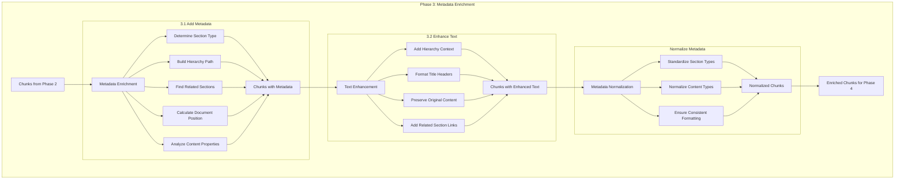

# Phase 3: Metadata Enrichment Implementation

## Overview

This document outlines the implementation strategy for Phase 3 of our Hierarchical RAG system for Markdown documentation. After completing document processing (Phase 1) and hierarchical chunking (Phase 2), Phase 3 focuses on enriching the chunks with comprehensive metadata and enhancing their text content with contextual information. This metadata enrichment will significantly improve the relevance and context-awareness of retrievals in later phases.

## Implementation Components

### 3.1 Chunk Metadata Schema

Our implementation will add a rich metadata schema to each chunk, providing critical context for retrieval and ranking.

#### Metadata Schema

```python
{
  "section_type": "API documentation | Concepts documentation | Optional | Internals",
  "hierarchy_path": ["Pydantic", "API documentation", "Fields"],
  "content_type": "link_list | descriptive_text | code_example | introduction | table_based",
  "related_sections": ["Concepts documentation > Fields"],
  "document_position": 0.25, // Normalized position in document
  "header_level": 2,
  "contains_links": true,
  "link_count": 12
}
```

### 3.2 Text Enhancement

In addition to metadata, we'll enhance the text content of each chunk with contextual information, making the chunks more self-contained while preserving their hierarchical context.

## Implementation Details

### Core Class: MetadataEnricher

```python
# metadata_enricher.py
import re

class MetadataEnricher:
    """
    Enriches document chunks with metadata and enhances text content
    with contextual information.
    """
    
    def __init__(self):
        self.section_types = ["API documentation", "Concepts documentation", 
                             "Optional", "Internals"]
    
    def enrich_chunk(self, chunk, document_tree):
        """Add comprehensive metadata to each chunk"""
        
        # Initialize base metadata structure
        metadata = {
            "section_type": self._determine_section_type(chunk, document_tree),
            "hierarchy_path": self._build_hierarchy_path(chunk, document_tree),
            "content_type": chunk.get("content_type", "unknown"),
            "related_sections": self._find_related_sections(chunk, document_tree),
            "document_position": self._calculate_position(chunk, document_tree),
            "header_level": chunk.get("header_level", 0),
            "contains_links": self._contains_links(chunk),
            "link_count": self._count_links(chunk)
        }
        
        # Attach metadata to chunk
        chunk["metadata"] = metadata
        
        return chunk
    
    def _determine_section_type(self, chunk, document_tree):
        """Determine the section type based on the hierarchy path"""
        # Extract from headers or document structure
        hierarchy = chunk.get("hierarchy_path", [])
        for path_element in hierarchy:
            for section_type in self.section_types:
                if section_type.lower() in path_element.lower():
                    return section_type
        
        # Default if not found
        return "General"

    def _build_hierarchy_path(self, chunk, document_tree):
        """Build a list representing the full hierarchy path to this chunk"""
        # If already present, return it
        if "hierarchy_path" in chunk:
            return chunk["hierarchy_path"]
        
        # Otherwise construct from parent references
        path = []
        current = chunk
        
        # Traverse upward through parent references
        while "parent" in current:
            parent = current["parent"]
            if "title" in parent and parent["title"]:
                path.insert(0, parent["title"])
            current = parent
        
        return path

    def _find_related_sections(self, chunk, document_tree):
        """Identify related sections based on title/content similarity"""
        related = []
        chunk_title = chunk.get("title", "")
        
        # Simple approach: match on similar titles
        if chunk_title:
            # Search for sections with similar titles
            for section in self._flatten_sections(document_tree):
                section_title = section.get("title", "")
                if (section_title and section_title != chunk_title and
                    (section_title in chunk_title or chunk_title in section_title)):
                    # Found related section, add its path
                    related.append(self._build_hierarchy_path(section, document_tree))
        
        return related

    def _calculate_position(self, chunk, document_tree):
        """Calculate normalized position (0-1) of chunk in document"""
        # We'll need a flattened list of all chunks to determine position
        all_chunks = self._flatten_chunks(document_tree)
        
        # Find position of this chunk in the document
        chunk_index = next((i for i, c in enumerate(all_chunks) 
                            if c.get("id") == chunk.get("id")), 0)
        
        # Normalize to 0-1 range
        total_chunks = len(all_chunks)
        return chunk_index / max(total_chunks - 1, 1)

    def _contains_links(self, chunk):
        """Check if chunk contains links"""
        content = chunk.get("content", "")
        # Simple check for markdown link pattern
        return "[" in content and "](" in content

    def _count_links(self, chunk):
        """Count number of links in chunk"""
        content = chunk.get("content", "")
        # Count markdown link patterns
        import re
        link_pattern = r"\[.*?\]\(.*?\)"
        links = re.findall(link_pattern, content)
        return len(links)

    def _flatten_sections(self, document_tree):
        """Flatten the document tree into a list of sections"""
        sections = []
        
        def traverse(node):
            # Add this node if it's a header/section
            if node.get("type") == "header":
                sections.append(node)
            
            # Recursively process children
            for child in node.get("children", []):
                traverse(child)
        
        traverse(document_tree)
        return sections

    def _flatten_chunks(self, document_tree):
        """Flatten the document into a list of all chunks"""
        chunks = []
        
        def traverse(node):
            # Add this node if it's a content chunk
            if "content" in node and node["content"]:
                chunks.append(node)
            
            # Recursively process children
            for child in node.get("children", []):
                traverse(child)
        
        traverse(document_tree)
        return chunks
    
    def enhance_chunk_text(self, chunk):
        """Enrich chunk text with contextual information"""
        enhanced_text = ""
        
        # Add hierarchy context if available
        hierarchy_path = chunk.get("metadata", {}).get("hierarchy_path", [])
        if hierarchy_path:
            # Format hierarchy as breadcrumb path
            breadcrumb = " > ".join(hierarchy_path)
            enhanced_text += f"Context: {breadcrumb}\n\n"
        
        # Add title if available
        if chunk.get("title"):
            header_level = chunk.get("metadata", {}).get("header_level", 2)
            header_markup = "#" * header_level
            enhanced_text += f"{header_markup} {chunk['title']}\n\n"
        
        # Add the original content
        enhanced_text += chunk.get("content", "")
        
        # Add related section references if available
        related_sections = chunk.get("metadata", {}).get("related_sections", [])
        if related_sections:
            enhanced_text += "\n\nRelated sections:\n"
            for section in related_sections:
                if isinstance(section, list):
                    section_path = " > ".join(section)
                else:
                    section_path = section
                enhanced_text += f"- {section_path}\n"
        
        # Update the chunk with enhanced text
        chunk["enhanced_text"] = enhanced_text
        
        return chunk
    
    def normalize_metadata(self, chunks):
        """Ensure consistent metadata across chunks"""
        # Collect all section types for normalization
        section_types = set()
        content_types = set()
        
        for chunk in chunks:
            metadata = chunk.get("metadata", {})
            if "section_type" in metadata:
                section_types.add(metadata["section_type"])
            if "content_type" in metadata:
                content_types.add(metadata["content_type"])
        
        # Normalize section types (ensure consistent casing, etc.)
        section_type_map = {}
        for section_type in section_types:
            normalized = section_type.strip().title()
            section_type_map[section_type] = normalized
        
        # Normalize content types
        content_type_map = {
            "link_list": "Link Collection",
            "descriptive_text": "Descriptive Content",
            "code_example": "Code Example",
            "introduction": "Introduction",
            "table_based": "Table Content"
        }
        
        # Apply normalization to all chunks
        for chunk in chunks:
            metadata = chunk.get("metadata", {})
            
            # Normalize section type
            if "section_type" in metadata:
                orig_type = metadata["section_type"]
                if orig_type in section_type_map:
                    metadata["section_type"] = section_type_map[orig_type]
            
            # Normalize content type
            if "content_type" in metadata:
                orig_type = metadata["content_type"]
                if orig_type in content_type_map:
                    metadata["content_type"] = content_type_map[orig_type]
        
        return chunks
    
    def process_chunks(self, chunks, document_tree):
        """Process all chunks with metadata enrichment and text enhancement"""
        enriched_chunks = []
        
        for chunk in chunks:
            # Add metadata
            enriched_chunk = self.enrich_chunk(chunk, document_tree)
            # Enhance text
            enhanced_chunk = self.enhance_chunk_text(enriched_chunk)
            enriched_chunks.append(enhanced_chunk)
        
        # Normalize metadata across all chunks
        normalized_chunks = self.normalize_metadata(enriched_chunks)
        
        return normalized_chunks
```

## Integration with Previous Phases

To integrate Phase 3 with the previous phases, we update the main processing pipeline:

```python
def process_document(markdown_file_path):
    """Complete document processing pipeline - Phases 1, 2, and 3"""
    # Phase 1: Document processing
    processor = MarkdownProcessor()
    with open(markdown_file_path, 'r') as f:
        markdown_text = f.read()
    
    parsed_doc = processor.parse_document(markdown_text)
    doc_tree = processor.build_hierarchy_tree(parsed_doc)
    processor.apply_classification(doc_tree)
    
    # Phase 2: Chunking
    chunker = HierarchicalChunker()
    chunks = chunker.create_chunks(doc_tree)
    cross_ref_chunks = chunker.establish_cross_references(chunks)
    
    # Phase 3: Metadata enrichment
    enricher = MetadataEnricher()
    enriched_chunks = enricher.process_chunks(cross_ref_chunks, doc_tree)
    
    return enriched_chunks, doc_tree
```

## File Structure

The implementation will follow this file structure:

```
archon/
├── llms_txt/
│   ├── __init__.py
│   ├── markdown_processor.py  # Phase 1 implementation
│   ├── hierarchical_chunker.py  # Phase 2 implementation
│   ├── metadata_enricher.py  # Phase 3 implementation (new)
│   └── process_docs.py  # Main script (updated)
└── output/
    └── processed_docs/  # Output directory
```

## Testing Strategy

A comprehensive testing approach will ensure the metadata enrichment functions correctly:

```python
# test_metadata_enricher.py
import unittest
from metadata_enricher import MetadataEnricher

class TestMetadataEnricher(unittest.TestCase):
    
    def setUp(self):
        self.enricher = MetadataEnricher()
        
        # Sample document tree and chunks for testing
        self.doc_tree = {
            "type": "document",
            "title": "Test Document",
            "children": [
                {
                    "type": "header",
                    "title": "API Documentation",
                    "level": 1,
                    "children": [
                        {
                            "type": "header",
                            "title": "Fields",
                            "level": 2,
                            "content": "This is content about fields.",
                            "id": "chunk1"
                        }
                    ]
                },
                {
                    "type": "header",
                    "title": "Concepts Documentation",
                    "level": 1,
                    "children": [
                        {
                            "type": "header",
                            "title": "Fields",
                            "level": 2,
                            "content": "This is concept content about fields.",
                            "id": "chunk2"
                        }
                    ]
                }
            ]
        }
        
        # Sample chunk for testing
        self.chunk = {
            "id": "chunk1",
            "title": "Fields",
            "content": "This is content about fields.",
            "header_level": 2,
            "hierarchy_path": ["API Documentation", "Fields"],
            "parent": {
                "title": "API Documentation",
                "parent": {
                    "title": "Test Document"
                }
            }
        }
    
    def test_determine_section_type(self):
        section_type = self.enricher._determine_section_type(self.chunk, self.doc_tree)
        self.assertEqual(section_type, "API documentation")
    
    def test_build_hierarchy_path(self):
        path = self.enricher._build_hierarchy_path(self.chunk, self.doc_tree)
        self.assertEqual(path, ["API Documentation", "Fields"])
    
    def test_find_related_sections(self):
        related = self.enricher._find_related_sections(self.chunk, self.doc_tree)
        self.assertTrue(any("Concepts Documentation" in str(r) for r in related))
    
    def test_enrich_chunk(self):
        enriched = self.enricher.enrich_chunk(self.chunk, self.doc_tree)
        self.assertIn("metadata", enriched)
        self.assertIn("section_type", enriched["metadata"])
        self.assertIn("hierarchy_path", enriched["metadata"])
    
    def test_enhance_chunk_text(self):
        self.chunk["metadata"] = {
            "section_type": "API documentation",
            "hierarchy_path": ["API Documentation", "Fields"],
            "related_sections": [["Concepts Documentation", "Fields"]]
        }
        
        enhanced = self.enricher.enhance_chunk_text(self.chunk)
        self.assertIn("enhanced_text", enhanced)
        self.assertIn("Context: API Documentation > Fields", enhanced["enhanced_text"])
        self.assertIn("Related sections", enhanced["enhanced_text"])
```

## Implementation Process



## Expected Outputs

After processing through Phase 3, each chunk will have:

1. A comprehensive metadata object including:
   - Hierarchical path information
   - Section and content type classifications
   - Related section references
   - Document positioning
   - Content property metrics

2. Enhanced text content that includes:
   - Contextual breadcrumb path
   - Properly formatted headers
   - Original content
   - Related section references

## Example Output

Here's an example of a chunk after Phase 3 processing:

```json
{
  "id": "chunk_12",
  "title": "Fields",
  "content": "Fields define the structure of the model...",
  "metadata": {
    "section_type": "API Documentation",
    "hierarchy_path": ["Pydantic", "API Documentation", "Fields"],
    "content_type": "Descriptive Content",
    "related_sections": [["Pydantic", "Concepts Documentation", "Fields"]],
    "document_position": 0.34,
    "header_level": 2,
    "contains_links": true,
    "link_count": 3
  },
  "enhanced_text": "Context: Pydantic > API Documentation > Fields\n\n## Fields\n\nFields define the structure of the model...\n\nRelated sections:\n- Pydantic > Concepts Documentation > Fields"
}
```

## Next Steps

After implementing Phase 3, we'll be ready to move on to Phase 4, which involves:

1. Setting up the vector database schema
2. Implementing the embedding strategy
3. Optimizing indexes for hierarchical retrieval

The rich metadata and enhanced text from Phase 3 will significantly improve the relevance and contextual accuracy of retrievals in the final system.