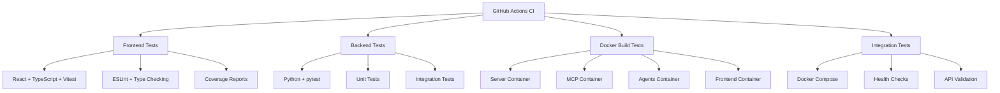

# CI/CD & Testing Strategy

Archon V2 Alpha uses a comprehensive GitHub Actions CI/CD pipeline that tests all components of the microservices architecture. This guide explains the testing strategy and how to work with the automated workflows.

## Overview

Our CI/CD pipeline consists of two main workflows:

1. **Continuous Integration** (`ci.yml`) - Runs on every push and pull request
2. **Security & Dependency Checks** (`security.yml`) - Runs on pushes to main/develop and weekly

## Architecture Tested

The CI pipeline validates all four core services:



## Frontend Testing (React + Vitest)

### Test Structure

```
archon-ui-main/
├── test/
│   ├── components.test.tsx          # Component tests
│   ├── pages.test.tsx              # Page integration tests
│   ├── user_flows.test.tsx         # End-to-end user flows
│   ├── errors.test.tsx             # Error handling tests
│   ├── setup.ts                    # Test configuration
│   └── components/                 # Component-specific tests
│       ├── project-tasks/
│       └── prp/
├── vitest.config.ts                # Vitest configuration
└── package.json                    # Test scripts
```

### Running Frontend Tests Locally

```bash
cd archon-ui-main

# Run all tests
npm run test

# Run with coverage
npm run test:coverage

# Run with UI
npm run test:ui

# Run with streaming output
npm run test:coverage:stream

# Lint check
npm run lint

# Type checking
npx tsc --noEmit
```

### Test Configuration Features

- **JSDOM Environment**: Simulates browser environment for React components
- **Mock Setup**: Comprehensive mocks for fetch, WebSocket, localStorage
- **Icon Mocking**: Smart proxy-based mocking for lucide-react icons
- **Coverage Reports**: HTML, JSON, and LCOV formats
- **Test Timeouts**: 10-second timeouts for stability

## Backend Testing (Python + pytest)

### Test Structure

```
python/
├── tests/
│   ├── conftest.py                 # Test configuration & fixtures
│   ├── test_api_essentials.py      # Core API tests
│   ├── test_business_logic.py      # Business logic tests
│   ├── test_service_integration.py # Service integration tests
│   ├── test_rag_strategies.py      # RAG functionality tests
│   └── test_async_*.py             # Async service tests
├── pytest.ini                     # pytest configuration
└── pyproject.toml                 # Dependencies & config
```

### Running Backend Tests Locally

```bash
cd python

# Install dependencies
uv sync --dev

# Run all tests
uv run pytest

# Run by category
uv run pytest -m unit
uv run pytest -m integration

# Run with coverage
uv run pytest --cov=src --cov-report=html

# Run specific test file
uv run pytest tests/test_api_essentials.py -v

# Run with verbose output
uv run pytest --verbose --tb=short
```

### Test Configuration Features

- **Automatic Mocking**: Prevents real database connections in all tests
- **FastAPI Test Client**: Full HTTP testing with TestClient
- **Async Support**: Full async/await test support
- **Marker Categories**: Unit vs integration test separation
- **Mock Fixtures**: Pre-configured Supabase client mocks

## Docker Build Testing

### Tested Images

The CI pipeline builds and tests all four Docker containers:

1. **Server** (`Dockerfile.server`) - FastAPI + Socket.IO backend
2. **MCP** (`Dockerfile.mcp`) - Lightweight MCP protocol server  
3. **Agents** (`Dockerfile.agents`) - PydanticAI agents service
4. **Frontend** (`Dockerfile`) - React production build

### Build Validation

Each container is tested for:
- **Build Success**: Container builds without errors
- **Health Checks**: Container starts and responds to health endpoints
- **Port Configuration**: Correct port exposure and binding
- **Environment Variables**: Proper configuration handling

## Integration Testing

### Full Stack Testing

The integration test job:

1. **Starts All Services**: Uses docker-compose to start the full stack
2. **Health Validation**: Verifies all services respond to health checks
3. **API Testing**: Tests core API endpoints across services
4. **Service Communication**: Validates inter-service communication

### Integration Test Scenarios

```bash
# Frontend accessibility
curl -f http://localhost:3737

# Server health
curl -f http://localhost:8181/health

# MCP protocol
curl -f http://localhost:8051/health

# Agents service
curl -f http://localhost:8052/health
```

## Security & Compliance Pipeline

### Security Scanning

The security workflow includes:

1. **Dependency Scanning**: npm audit (frontend) and safety (backend)
2. **Container Security**: Trivy vulnerability scanning
3. **Secrets Detection**: TruffleHog for committed secrets
4. **License Compliance**: Dependency license verification

### Running Security Checks Locally

```bash
# Frontend security audit
cd archon-ui-main
npm audit --audit-level=high

# Backend security check
cd python
uv add safety
uv run safety check

# Check for secrets (manual)
grep -r "api[_-]key.*=.*['\"][a-zA-Z0-9]{20,}" . --exclude-dir=.git
```

## CI Pipeline Triggers

### Automatic Triggers

- **Push to main/develop**: Full CI + security pipeline
- **Pull Requests**: Full CI pipeline
- **Weekly Schedule**: Security pipeline only (Mondays 2 AM UTC)

### Manual Triggers

Both workflows support manual triggering via GitHub Actions UI.

## Test Results & Artifacts

### Generated Artifacts

- **Frontend Coverage**: HTML reports and LCOV files
- **Backend Coverage**: HTML reports and XML files
- **Test Results**: JUnit XML format for integration
- **Security Reports**: JSON vulnerability reports
- **Docker Images**: Temporarily stored for testing

### Coverage Integration

- **Codecov**: Automated coverage upload for both frontend and backend
- **GitHub Summaries**: Test results displayed in workflow summaries
- **Pull Request Comments**: Coverage changes shown in PR reviews

## Working with the CI Pipeline

### Before Committing

Always run tests locally before pushing:

```bash
# Frontend checks
cd archon-ui-main
npm run lint
npm run test:coverage
npx tsc --noEmit

# Backend checks  
cd python
uv run pytest --cov=src
uv run ruff check src/ tests/ || true  # If ruff is installed
```

### Pull Request Checklist

The CI pipeline validates that PRs:

- [ ] All existing tests pass
- [ ] New tests added for new functionality
- [ ] Linting passes for both frontend and backend
- [ ] Type checking passes (TypeScript + Python)
- [ ] Docker builds succeed for all services
- [ ] No high-severity security vulnerabilities
- [ ] Integration tests pass

### Handling CI Failures

#### Common Frontend Issues

```bash
# Type errors
npx tsc --noEmit

# Linting errors  
npm run lint --fix

# Test failures
npm run test --reporter=verbose
```

#### Common Backend Issues

```bash
# Import errors
uv run python -c "from src.server.main import app"

# Test failures with details
uv run pytest tests/ --verbose --tb=long

# Mock issues
uv run pytest tests/ -k "test_name" -s
```

## Performance Considerations

### CI Optimization Features

- **Parallel Jobs**: Frontend and backend tests run simultaneously
- **Matrix Strategy**: Docker builds use parallel matrix execution  
- **Caching**: Node modules and Python dependencies cached
- **Conditional Execution**: Integration tests only on PRs and main
- **Artifact Cleanup**: 30-day retention to manage storage

### Test Performance

- **Frontend**: ~2-3 minutes for full test suite with coverage
- **Backend**: ~3-5 minutes for all tests with coverage
- **Docker Builds**: ~2-4 minutes per container (parallel)
- **Integration**: ~3-5 minutes for full stack testing

## Alpha Project Considerations

### Pragmatic Approach

As an alpha project, our CI strategy balances:

- **Fast Iteration**: Tests should not slow down development
- **Quality Assurance**: Catch breaking changes before they affect users
- **Security Awareness**: Prevent secrets and critical vulnerabilities
- **Documentation**: Maintain test coverage for better collaboration

### Test Coverage Goals

- **Frontend**: Focus on component behavior and user interactions
- **Backend**: Emphasize API contracts and business logic
- **Integration**: Verify service communication and health
- **Security**: Prevent secrets and critical dependency vulnerabilities

## Troubleshooting

### Common Issues

1. **Supabase Connection Errors**: Check environment variable setup
2. **Port Conflicts**: Verify port configuration in docker-compose
3. **Mock Failures**: Review conftest.py and test setup
4. **Type Errors**: Ensure TypeScript configurations match

### Debug Commands

```bash
# View CI logs locally
docker-compose up --build -d
docker-compose logs --follow

# Test individual services
docker run --rm -p 8181:8181 archon-server:latest
curl http://localhost:8181/health

# Check test configuration
cd archon-ui-main && npm run test -- --reporter=verbose
cd python && uv run pytest --collect-only
```

## Contributing to Tests

### Adding Frontend Tests

1. Create test files following naming convention: `*.test.tsx`
2. Use existing mocks and setup from `test/setup.ts`
3. Focus on component behavior, not implementation details
4. Include error cases and edge conditions

### Adding Backend Tests

1. Use appropriate markers: `@pytest.mark.unit` or `@pytest.mark.integration`
2. Leverage existing fixtures from `conftest.py`
3. Mock external dependencies (Supabase, OpenAI, etc.)
4. Test both success and error scenarios

### Integration Test Updates

When adding new services or endpoints:

1. Update Docker health checks
2. Add new API validation steps
3. Consider service startup dependencies
4. Update integration test timeouts if needed

The CI pipeline is designed to grow with the project while maintaining the alpha development principles of fast iteration and detailed error reporting.